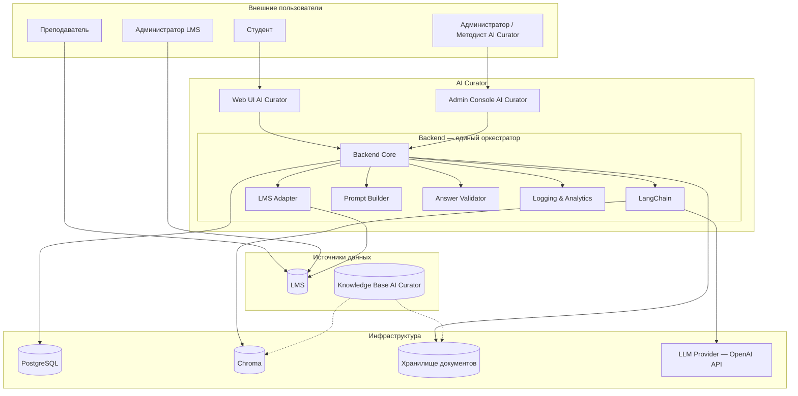

# AI Curator

AI-куратор для образовательных программ. Помогает студентам ориентироваться в учебном процессе, находить ответы в учебных материалах, разбирать сложные темы и получать персональные рекомендации — с явными ссылками на источники и чёткими границами ответственности.

AI Curator — самостоятельная подсистема образовательной платформы. Он не заменяет преподавателя, не выставляет оценки и не изменяет учебный процесс. Система разворачивается на VPS как полноценный публичный сервис.

---

## Live Demo

🌐 **Web UI:** `https://curator.alex-n8n.site`

Откройте, выберите demo-роль и задайте вопрос AI-куратору. Safe demo mode защищает API-лимиты: квота запросов, rate limit и таймер сессии.

Скриншоты и бизнес-сценарии — в [`docs/SYSTEM_DEMO.md`](docs/SYSTEM_DEMO.md) и [`docs/E2E_SCENARIOS.md`](docs/E2E_SCENARIOS.md).

---

## Зачем нужен AI Curator

Студенты постоянно сталкиваются с вопросами:

- «Когда дедлайн по заданию?»
- «Где найти лекцию по теме X?»
- «Объясни разницу между списком и словарём.»
- «Что мне повторить перед заданием в пятницу?»

Преподаватели отвечают на однотипные вопросы многократно, а актуальная информация разрознена между LMS, мессенджерами и email.

**AI Curator решает эту проблему**, предоставляя студенту единый публичный Web UI для персонализированных, подтверждённых источниками ответов на основе двух независимых источников:

- **LMS** — Source of Truth учебного процесса (расписание, задания, дедлайны, прогресс);
- **Knowledge Base AI Curator** — управляемая база учебных материалов (лекции, методички, FAQ).

Больше о бизнес-ценности — в [`docs/BUSINESS_VALUE.md`](docs/BUSINESS_VALUE.md).

---

## Для кого

- Образовательные платформы с LMS.
- Корпоративные учебные центры.
- Онлайн-школы и университеты.
- Провайдеры LMS, желающие добавить AI-куратора в экосистему.

---

## Ключевые возможности

- **Наставнический диалог** — AI общается в поддерживающем стиле и помогает разобраться.
- **Организационные ответы** — дедлайны, задания, расписание, прогресс берутся из LMS в реальном времени.
- **Учебные ответы** — система находит релевантные материалы в Knowledge Base и объясняет темы простыми словами или углублённо.
- **Персональные рекомендации** — AI предлагает следующие шаги с учётом прогресса и текущего модуля.
- **Ссылки на источники** — каждый содержательный ответ содержит ссылку на материал или явно сообщает, что источник не найден.
- **Адаптация сложности** — ответы подстраиваются под уровень подготовки студента.
- **Чёткие границы** — AI Curator не выставляет оценки, не переносит дедлайны и не изменяет учебный процесс.
- **Safe demo mode** — защищённый публичный доступ с квотами и rate limit.

---

## Быстрый обзор архитектуры

- **LMS** — Source of Truth учебного процесса.
- **Knowledge Base** — самостоятельный источник учебных материалов.
- **Backend** — единый оркестратор, который классифицирует запросы, объединяет контекст и вызывает LLM.
- **LangChain** — внутренняя библиотека Backend для RAG.

Подробнее — в [`docs/ARCHITECTURE.md`](docs/ARCHITECTURE.md).

---

## Публичные точки входа

| Сервис | Домен | Назначение |
|--------|-------|-----------|
| Web UI студента | `https://curator.alex-n8n.site` | Диалог со студентами |
| Admin Console | `https://curator-admin.alex-n8n.site` | Управление Knowledge Base, AI-конфигурацией, логами |
| Backend API | `https://curator-api.alex-n8n.site` | API AI Curator |
| Moodle LMS | `https://lms.alex-n8n.site` | Штатный интерфейс LMS |

---

## Документация по слоям

### Для заказчиков и менеджеров

| Документ | Описание |
|----------|----------|
| [`docs/BUSINESS_VALUE.md`](docs/BUSINESS_VALUE.md) | Бизнес-проблема, решение, эффект, выгода |
| [`docs/SYSTEM_DEMO.md`](docs/SYSTEM_DEMO.md) | Скриншоты, live demo, бизнес-сценарии |
| [`docs/E2E_SCENARIOS.md`](docs/E2E_SCENARIOS.md) | Сквозные бизнес-сценарии без технических деталей |

### Для пользователей и операторов

| Документ | Описание |
|----------|----------|
| [`docs/USER_GUIDE.md`](docs/USER_GUIDE.md) | Как пользоваться Web UI студенту |
| [`docs/ADMIN_GUIDE.md`](docs/ADMIN_GUIDE.md) | Руководство администратора AI Curator |
| [`docs/CURATOR_GUIDE.md`](docs/CURATOR_GUIDE.md) | Руководство методиста по Knowledge Base |
| [`docs/FAQ.md`](docs/FAQ.md) | Частые вопросы |

### Для инженеров и интеграторов

| Документ | Описание |
|----------|----------|
| [`docs/ARCHITECTURE.md`](docs/ARCHITECTURE.md) | Архитектурные решения, C4, потоки данных |
| [`docs/SPEC.md`](docs/SPEC.md) | Продуктовая спецификация |
| [`docs/IMPLEMENTATION_PLAN.md`](docs/IMPLEMENTATION_PLAN.md) | План реализации и развёртывания |
| [`docs/API_CONTRACT.md`](docs/API_CONTRACT.md) | API endpoints и payload |
| [`docs/DEPLOYMENT_GUIDE.md`](docs/DEPLOYMENT_GUIDE.md) | Развёртывание с нуля |
| [`docs/OPERATIONS.md`](docs/OPERATIONS.md) | Эксплуатация, KB, AI-config, аналитика |
| [`docs/PROMPT_ARCHITECTURE.md`](docs/PROMPT_ARCHITECTURE.md) | Структура промптов |

---

## Статус проекта

Реализованы все ключевые компоненты: LMS-интеграция, Knowledge Base, RAG, LLM Chat, Admin Console, Analytics, Audit, Response Cache, safe demo mode, log export и retention policy.

`pytest`: 109 passed.

Текущее состояние и следующий шаг — в [`docs/PROJECT_STATE.md`](docs/PROJECT_STATE.md).

---

## Технологии

- **LMS** — Moodle (или другая LMS с API).
- **Backend** — FastAPI.
- **RAG / LLM Library** — LangChain внутри Backend.
- **Vector Store** — Chroma.
- **Database** — PostgreSQL.
- **LLM Provider** — OpenAI API.
- **Frontend** — React + Vite + Tailwind CSS.
- **Infra** — Docker, Docker Compose, nginx, Traefik.

---

## Лицензия

© AI Curator. Права защищены.

Проект разработан в инженерной среде AI Automation Portfolio Lab.
