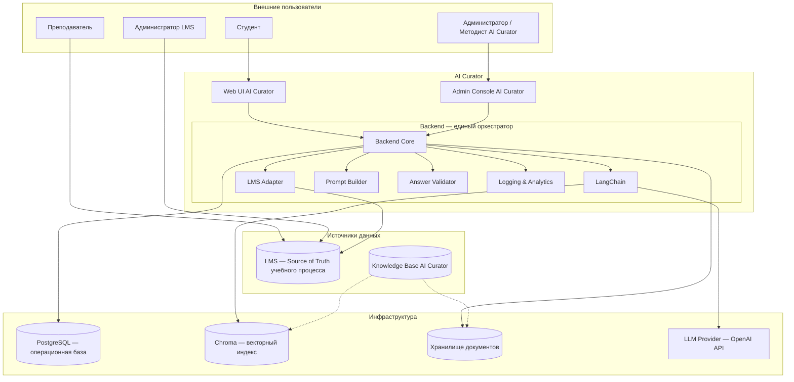

# AI Curator

AI-куратор для образовательных программ. Помогает студентам ориентироваться в учебном процессе, находить ответы в учебных материалах, разбирать сложные темы и получать персональные рекомендации — с явными ссылками на источники и чёткими границами ответственности.

AI Curator — самостоятельная подсистема образовательной платформы. Он не заменяет преподавателя, не выставляет оценки и не изменяет учебный процесс. Система разворачивается на VPS как полноценный публичный сервис.

---

## Позиционирование

AI Curator — цифровой наставник для студентов онлайн- и смешанного обучения. Он берёт на себя рутинные вопросы организации и содержания курса, чтобы преподаватели могли сосредоточиться на сложных случаях и развитии курса.

Продукт ориентирован на:
- образовательные платформы;
- корпоративные учебные центры;
- онлайн-школы и университеты с собственной LMS.

## Решаемая проблема

Студенты постоянно сталкиваются с вопросами:
- «Когда дедлайн по заданию?»
- «Где найти лекцию по теме X?»
- «Объясни разницу между списком и словарём.»
- «Что мне повторить перед заданием в пятницу?»

Преподаватели отвечают на однотипные вопросы многократно, а актуальная информация разрознена между LMS, мессенджерами и email.

**AI Curator решает эту проблему**, предоставляя студенту единый публичный Web UI для персонализированных, подтверждённых источниками ответов на основе двух независимых источников:
- **LMS** — данные учебного процесса (расписание, задания, дедлайны, прогресс);
- **Knowledge Base AI Curator** — учебные материалы (лекции, методички, FAQ), управляемые через Admin Console.

## Пользователи

| Роль | Задача | Интерфейс |
|------|--------|-----------|
| **Студент** | Задавать вопросы, получать ответы с источниками, оценивать полезность | Web UI AI Curator |
| **Преподаватель** | Управлять курсом, заданиями, оценками; при наличии прав — видеть агрегированную аналитику по курсу | LMS |
| **Администратор LMS** | Управлять LMS, пользователями, ролями и интеграцией | LMS Admin |
| **Администратор AI Curator** | Управлять Knowledge Base, конфигурацией AI, аналитикой, мониторингом | Admin Console AI Curator |
| **Методист AI Curator** | Управлять учебными материалами, метаданными, публикациями, дополнять FAQ | Admin Console AI Curator |

## Ключевые возможности

- **Наставнический диалог** — AI общается в поддерживающем стиле и помогает разобраться.
- **Организационные ответы** — дедлайны, задания, расписание, прогресс берутся из LMS в реальном времени.
- **Учебные ответы** — система находит релевантные материалы в Knowledge Base и объясняет темы простыми словами или углублённо.
- **Персональные рекомендации** — AI предлагает следующие шаги с учётом прогресса и текущего модуля.
- **Ссылки на источники** — каждый содержательный ответ содержит ссылку на материал или явно сообщает, что источник не найден.
- **Адаптация сложности** — ответы подстраиваются под уровень подготовки студента.
- **Чёткие границы** — AI Curator не выставляет оценки, не переносит дедлайны и не изменяет учебный процесс.

## Пользовательские интерфейсы

### Web UI для студента

- **Отдельный публичный Web UI AI Curator**, развёрнутый на VPS и доступный по собственному HTTPS-эндпоинту.
- Чат с AI-куратором, история диалога, переключатель уровня сложности.
- Источники ответа отображаются как ссылки на материалы Knowledge Base или задания в LMS.
- Web UI не является частью Moodle и не встраивается в LMS-интерфейс.

### Moodle LMS

- Moodle остаётся единственным инструментом для управления курсами, заданиями, расписанием, оценками и пользователями.
- AI Curator не дублирует административные функции Moodle.
- Moodle и Web UI AI Curator — отдельные пользовательские интерфейсы, взаимодействующие с собственными Backend-системами.

### Admin Console AI Curator

- Загрузка и управление учебными материалами Knowledge Base.
- Управление метаданными, версиями и публикацией документов.
- Запуск обработки, индексации и переиндексации.
- Конфигурация AI, аналитика запросов, мониторинг системы.

## Краткая архитектура

- **LMS** — Source of Truth учебного процесса. AI Curator читает разрешённые данные через LMS Adapter.
- **Knowledge Base AI Curator** — самостоятельный источник учебных материалов, управляемый через Admin Console. Не является частью LMS.
- **Backend** — единый оркестратор системы. Принимает запросы, классифицирует их, получает данные из LMS и Knowledge Base, формирует промпт, вызывает LLM, проверяет ответ, логирует и отдаёт результат.
- **LangChain** — внутренняя библиотека Backend для document loaders, chunking, embeddings, retrieval, prompt assembly и вызовов LLM.
- **LMS Adapter** — внутренний компонент Backend, изолирующий AI Curator от деталей LMS API.
- **Векторный индекс (Chroma)** — производное хранилище, восстанавливаемое из документов Knowledge Base.

## Статус проекта

**Текущая стадия:** Implementation In Progress — LMS развёрнута, Backend в разработке.

- ✅ Проект согласован с куратором.
- ✅ Подготовлены PROJECT_STATE.md, SPEC.md, ARCHITECTURE.md и IMPLEMENTATION_PLAN.md.
- ✅ Moodle LMS развёрнута на VPS и доступна по `https://lms.alex-n8n.site`.
- ✅ В Moodle создан демо-курс «Claude Code: от знакомства до автоматизации» (AI Skills Lab) с модулями, уроками, заданиями, дедлайнами и формами обратной связи.
- ✅ Создан read-only API-токен для интеграции с Moodle.
- ✅ Первый коммит запушен на GitHub: https://github.com/AlexLvGulyaev/AI-Curator.git
- ⏳ Следующий шаг — День 3 IMPLEMENTATION_PLAN: Backend scaffold на FastAPI, LMS Adapter, health endpoints.

## Планируемые публичные точки входа

| Сервис | Домен | Назначение |
|--------|-------|------------|
| Web UI студента | `https://curator.alex-n8n.site` | Публичный интерфейс для диалога со студентами |
| Admin Console | `https://curator-admin.alex-n8n.site` | Управление Knowledge Base, AI-конфигурацией, логами |
| Backend API | `https://curator-api.alex-n8n.site` | API AI Curator |
| Moodle LMS | `https://lms.alex-n8n.site` | Штатный интерфейс LMS |

## Скриншоты и демонстрация

Раздел зарезервирован для будущих скриншотов и демонстрационных материалов:

- **Web UI студента** — диалог с AI-куратором, источники ответа, переключатель уровня сложности.
- **Admin Console** — панель состояния Knowledge Base, управление документами, аналитика запросов.
- **LMS** — курс с заданиями и расписанием, на основе которых AI Curator даёт организационные ответы.
- **Live Demo** — публичная демонстрация работы сервиса после деплоя.

## Документация

| Документ | Назначение |
|----------|------------|
| `docs/PROJECT_STATE.md` | Состояние проекта, решения, риски, следующий шаг |
| `docs/SPEC.md` | Продуктовая спецификация, сценарии, требования |
| `docs/ARCHITECTURE.md` | Архитектурные решения, компоненты, потоки данных, диаграммы |
| `docs/IMPLEMENTATION_PLAN.md` | План реализации и развёртывания на VPS |

## Технологии

- **LMS** — Moodle или другая LMS с API.
- **FastAPI** — backend AI Curator.
- **LangChain** — AI / RAG библиотека внутри Backend.
- **Chroma** — векторное хранилище.
- **PostgreSQL** — операционная база (метаданные, логи, аналитика, аудит).
- **Object Storage / файловое хранилище** — исходные документы Knowledge Base.
- **OpenAI API** — LLM Provider.
- **Docker + Docker Compose** — контейнеризация.
- **nginx / Traefik** — reverse proxy и HTTPS на VPS.

## Лицензия

© AI Curator. Права защищены.

Проект разработан в инженерной среде AI Automation Portfolio Lab.
