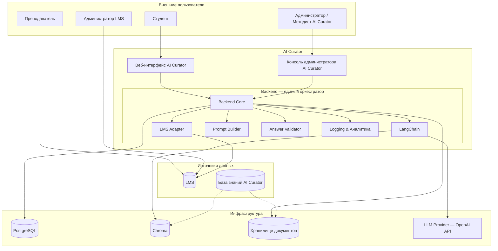

# 🎓 AI Curator

⚡ **Снизьте нагрузку на преподавателей в 5 раз и дайте студентам мгновенные ответы 24/7.**

AI Curator — AI-ассистент для образовательных платформ, который отвечает на типовые вопросы студентов за секунды вместо часов ожидания преподавателя. Система берёт дедлайны и задания из LMS, а учебные материалы — из управляемой Базы знаний, и всегда указывает источник: кликабельную ссылку на задание или карточку материала.

- Студент спрашивает «Когда сдавать третье задание?» — получает точный дедлайн из LMS.
- Студент просит «Объясни chain-of-thought» — получает ответ из Базы знаний с уровнем сложности под себя.
- Преподаватель видит аналитику: какие темы вызывают вопросы, где не хватает материалов, какая нагрузка на поддержку.

AI Curator не заменяет преподавателя, не выставляет оценки и не меняет учебный процесс. Он забирает рутину, чтобы преподаватель занимался тем, что действительно важно.

[▶️ Попробовать live demo](https://curator.alex-n8n.site) · [📊 Бизнес-ценность](docs/BUSINESS_VALUE.md) · [📖 Как это работает](docs/SYSTEM_DEMO.md)

---

## ▶️ Live Demo

🌐 **Студенту:** [▶️ Открыть веб-интерфейс](https://curator.alex-n8n.site)

Выберите demo-роль и задайте вопрос AI-ассистенту. Demo-режим работает с квотой запросов, rate limit и таймером сессии.

Скриншоты, live demo и бизнес-сценарии — в [`docs/SYSTEM_DEMO.md`](docs/SYSTEM_DEMO.md) и [`docs/E2E_SCENARIOS.md`](docs/E2E_SCENARIOS.md).

---

## ❓ Зачем нужен AI Curator

Студенты постоянно сталкиваются с вопросами:

- «Когда дедлайн по заданию?»
- «Где найти лекцию по теме X?»
- «Объясни разницу между списком и словарём.»
- «Что мне повторить перед заданием в пятницу?»

Преподаватели отвечают на однотипные вопросы многократно, а актуальная информация разрознена между LMS, мессенджерами и email.

**AI Curator решает эту проблему**, предоставляя студенту единый публичный Веб-интерфейс для персонализированных, подтверждённых источниками ответов на основе двух независимых источников:

- **LMS** — Source of Truth учебного процесса (расписание, задания, дедлайны, прогресс);
- **База знаний AI Curator** — управляемая база учебных материалов (лекции, методички, FAQ).

Больше о бизнес-ценности — в [`docs/BUSINESS_VALUE.md`](docs/BUSINESS_VALUE.md).

---

## 🎯 Для кого

- Образовательные платформы с LMS.
- Корпоративные учебные центры.
- Онлайн-школы и университеты.
- Провайдеры LMS, желающие добавить AI-ассистента в экосистему.

---

## ✨ Ключевые возможности

- **Наставнический диалог** — AI общается в поддерживающем стиле и помогает разобраться.
- **Организационные ответы** — дедлайны, задания, расписание, прогресс берутся из LMS в реальном времени.
- **Учебные ответы** — система находит релевантные материалы в Базе знаний и объясняет темы простыми словами или углублённо.
- **Персональные рекомендации** — AI предлагает следующие шаги с учётом прогресса и текущего модуля.
- **Ссылки на источники** — каждый содержательный ответ сопровождается карточками источников: кликабельные LMS-ссылки и бейджи Базы знаний.
- **Адаптация сложности** — ответы подстраиваются под уровень подготовки студента.
- **Чёткие границы** — AI Curator не выставляет оценки, не переносит дедлайны и не изменяет учебный процесс.
- **Safe demo mode** — защищённый публичный доступ с квотами и rate limit.

---

## 🏗️ Краткий обзор архитектуры

- **LMS** — Source of Truth учебного процесса.
- **База знаний** — самостоятельный источник учебных материалов.
- **Backend** — единый оркестратор, который классифицирует запросы, объединяет контекст и вызывает LLM.
- **LangChain** — внутренняя библиотека Backend для RAG.

Подробнее — в [`docs/ARCHITECTURE.md`](docs/ARCHITECTURE.md).

---

## 🌐 Публичные точки входа

| Роль | Сервис | Домен | Назначение |
|------|--------|-------|-----------|
| Студент | Веб-интерфейс | [curator.alex-n8n.site](https://curator.alex-n8n.site) | Диалог с AI-ассистентом |
| Администратор / Методист | Консоль администратора | [curator-admin.alex-n8n.site](https://curator-admin.alex-n8n.site) | Управление Базой знаний, AI-конфигурацией, логами |
| Интегратор | Backend API | [curator-api.alex-n8n.site](https://curator-api.alex-n8n.site) | API AI Curator |
| Преподаватель | Moodle LMS | [lms.alex-n8n.site](https://lms.alex-n8n.site) | Штатный интерфейс LMS |

---

## 📚 Документация

### Для заказчиков и менеджеров

| Документ | Описание |
|----------|----------|
| [📈 `docs/BUSINESS_VALUE.md`](docs/BUSINESS_VALUE.md) | Бизнес-проблема, решение, эффект, выгода |
| [🎬 `docs/SYSTEM_DEMO.md`](docs/SYSTEM_DEMO.md) | Скриншоты, live demo, бизнес-сценарии |
| [🎬 `docs/E2E_SCENARIOS.md`](docs/E2E_SCENARIOS.md) | Сквозные бизнес-сценарии без технических деталей |

### Для пользователей и операторов

| Документ | Описание |
|----------|----------|
| [📖 `docs/USER_GUIDE.md`](docs/USER_GUIDE.md) | Как пользоваться веб-интерфейсом студенту |
| [🎛️ `docs/ADMIN_GUIDE.md`](docs/ADMIN_GUIDE.md) | Руководство администратора AI Curator |
| [🧠 `docs/CURATOR_GUIDE.md`](docs/CURATOR_GUIDE.md) | Руководство методиста по Базе знаний |
| [❓ `docs/FAQ.md`](docs/FAQ.md) | Частые вопросы |

### Для инженеров и интеграторов

| Документ | Описание |
|----------|----------|
| [🏗️ `docs/ARCHITECTURE.md`](docs/ARCHITECTURE.md) | Архитектурные решения, C4, потоки данных |
| [📋 `docs/SPEC.md`](docs/SPEC.md) | Продуктовая спецификация |
| [📅 `docs/IMPLEMENTATION_PLAN.md`](docs/IMPLEMENTATION_PLAN.md) | План реализации и развёртывания |
| [🔌 `docs/API_CONTRACT.md`](docs/API_CONTRACT.md) | API endpoints и payload |
| [🚀 `docs/DEPLOYMENT_GUIDE.md`](docs/DEPLOYMENT_GUIDE.md) | Развёртывание с нуля |
| [⚙️ `docs/OPERATIONS.md`](docs/OPERATIONS.md) | Эксплуатация, KB, AI-config, аналитика |
| [📝 `docs/PROMPT_ARCHITECTURE.md`](docs/PROMPT_ARCHITECTURE.md) | Структура промптов |

---

## ✅ Статус проекта

Реализованы все ключевые компоненты: LMS-интеграция, База знаний, RAG, LLM Chat, Консоль администратора, Аналитика, Audit, Response Cache, safe demo mode, log export и retention policy.

`pytest`: 109 passed.

Текущее состояние и следующий шаг — в [📍 `docs/PROJECT_STATE.md`](docs/PROJECT_STATE.md).

---

## 🛠️ Технологии

- **LMS** — Moodle (или другая LMS с API).
- **Backend** — FastAPI.
- **RAG / LLM Library** — LangChain внутри Backend.
- **Vector Store** — Chroma.
- **Database** — PostgreSQL.
- **LLM Provider** — OpenAI API.
- **Frontend** — React + Vite + Tailwind CSS.
- **Infra** — Docker, Docker Compose, nginx, Traefik.

---

## 📄 Лицензия

© AI Curator. Права защищены.

Проект разработан в инженерной среде AI Automation Portfolio Lab.
