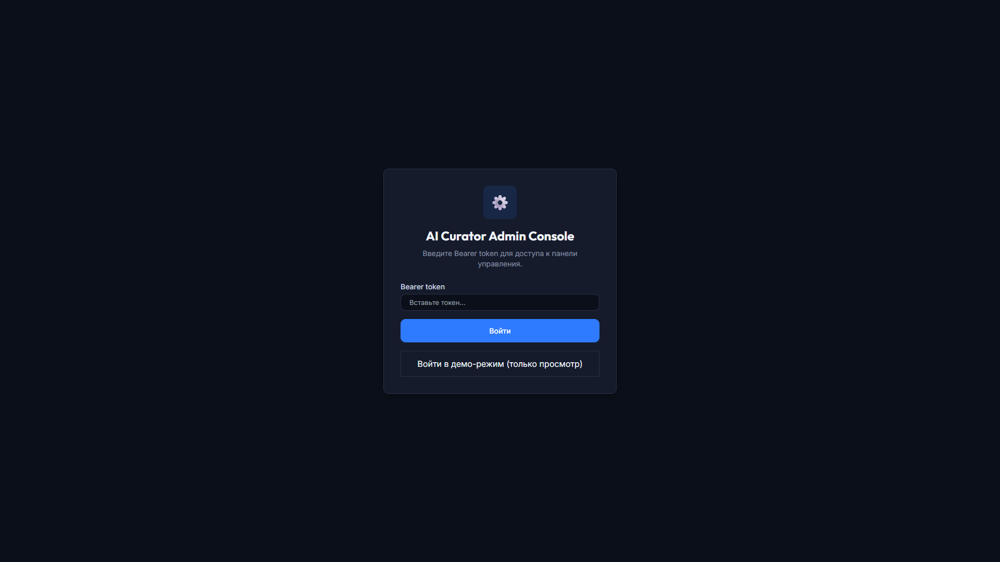
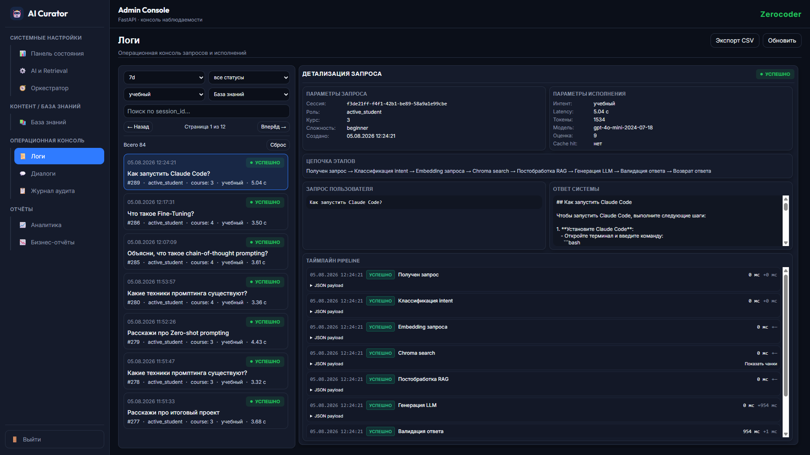
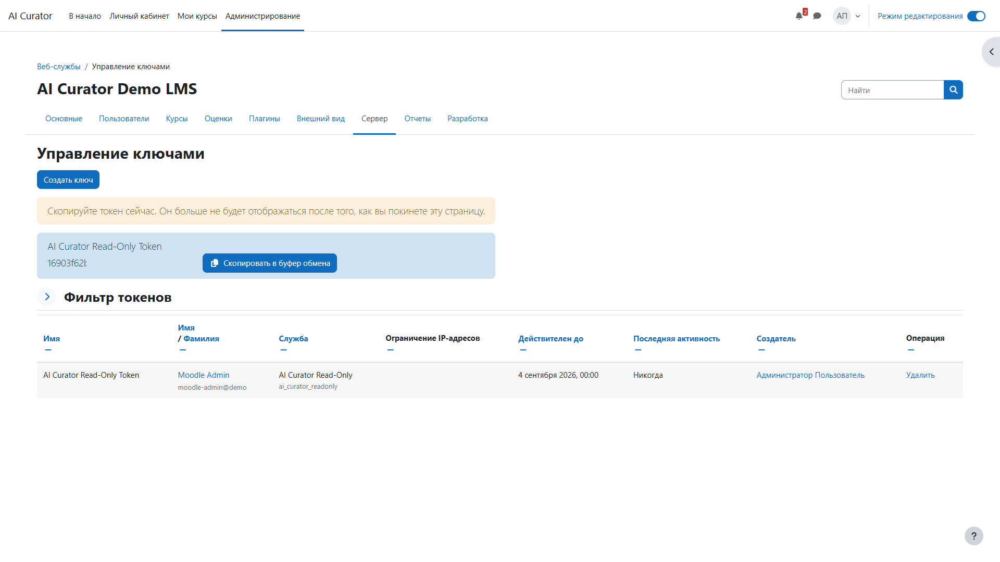

# 🎛️ AI Curator — руководство администратора

**Проект:** ai-curator  
**Дата:** 2026-08-05

🌐 **Консоль администратора:** [▶️ Открыть админ-панель](https://curator-admin.alex-n8n.site)

---

## 🎯 1. Назначение

Это руководство для **администратора AI Curator** — человека, который управляет Базой знаний, AI-конфигурацией, аналитикой, мониторингом и безопасностью системы.

Администратор AI Curator не управляет учебным процессом в LMS. Курсы, задания, дедлайны и оценки остаются в ведении LMS.

---

## 🔐 2. Вход в Консоль администратора

1. Откройте [▶️ Консоль администратора](https://curator-admin.alex-n8n.site).
2. Введите Bearer-токен из переменной окружения `ADMIN_CONSOLE_TOKEN`.
3. Нажмите **Войти**.

Токен хранится в `localStorage` браузера и передаётся в заголовке `Authorization: Bearer <token>`.

> 🔓 **Demo-режим:** если выбрана кнопка демо-входа, токен не требуется. В demo-режиме доступен только просмотр: кнопки мутаций заблокированы, а в интерфейсе отображается бейдж `🔒 Demo`.

---

## 🏥 3. Панель состояния

Панель состояния показывает общее состояние системы:

- количество документов Базе знаний;
- активная и резервная AI-конфигурация;
- статус LLM-провайдера;
- краткая аналитика запросов.

---

## 🧠 4. База знаний

Раздел **База знаний → Документы** — трёхпанельная операционная консоль:

- **Список документов** слева — фильтры, поиск, статусы.
- **Детальная карточка** по центру — метаданные, версии, чанки.
- **Жизненный цикл** справа — timeline событий обработки.

Для загрузки нового документа нажмите **Загрузить файл**, заполните метаданные и выберите файл.

После сохранения и индексации открывается детальная карточка документа: паспорт, версии, чанки и preview текста.

---

## 🤖 5. AI & Retrieval Configuration

В разделе **AI Config** управляются:

- `system_prompt` — роль и правила AI Curator;
- модель LLM, temperature, max_tokens;
- `top_k_retrieval` и `rag_distance_threshold`;
- инструкции для уровней Beginner / Advanced;
- few-shot примеры;
- правила вывода и текст отказа.

Каждая новая версия конфигурации создаётся неактивной. Активация производится отдельной кнопкой.

---

## 🎼 6. Настройки оркестратора

Orchestrator определяет:

- интент-классификацию по ключевым словам;
- source routing: LMS, База знаний, оба источника, strict_course;
- token-бюджеты по интентам;
- fallback-сообщения;
- размеры LMS-контекста.

Подробнее см. [`ORCHESTRATOR_USER_GUIDE.md`](ORCHESTRATOR_USER_GUIDE.md).

---

## 📊 7. Аналитика и отчёты

### Панель аналитики

- KPI за период;
- latency histogram;
- распределение источников ответов;
- популярные темы;
- динамика по курсам.

### Управленческие отчёты и отчёты качества

- качество ответов;
- вопросы без ответа;
- гэпы Базы знаний;
- кандидаты на расширение KB;
- CSV export.

---

## 🗣️ 8. Операционные логи и Диалоговые сессии

### Операционные логи

Операционные логи показывают каждый запрос студента с фильтрами по роли, источнику, интенту, статусу и дате.

### Диалоговые сессии

Диалоговые сессии показывают полный timeline обработки запроса: получение запроса → классификация intent → embedding → Chroma search → RAG-постобработка → генерация LLM → валидация → ответ.

---

## 📜 9. Журнал аудита

Журнал аудита фиксирует изменяющие действия в системе:

- активация AI-конфигурации;
- публикация документа KB;
- обновление Orchestrator-конфигурации;
- chat-запросы студентов (с `session_id`, `ip_address`).

---

## 📤 10. Экспорт логов

В разделах Операционные логи, Журнал аудита и Диалоговые сессии доступен экспорт в CSV.

Политика ротации:

- hot logs хранятся 30 дней, затем архивируются в `ARCHIVE_DIR`;
- LLM traces хранятся 7 дней;
- архивы — gzip JSON Lines.

Подробнее см. [`OPERATIONS.md`](OPERATIONS.md) раздел 9.

---

## 🔌 11. Интеграция с LMS

AI Curator читает данные учебного процесса из Moodle LMS через read-only Web Services token.

### Требования к LMS

1. Включены Moodle Web Services.
2. Создан read-only токен с правами на чтение курсов, заданий, пользователей, прогресса.
3. Курс, модули и задания заведены в LMS.

### Где взять токен

Moodle: **Site administration → Server → Web services → Manage tokens**.

Токен указывается в переменной окружения `LMS_API_TOKEN`. Никогда не коммитьте токен в репозиторий.

---

## 🔒 12. Demo-режим Консоль администратора

Для публичных демонстраций можно использовать `ADMIN_CONSOLE_DEMO_TOKEN`:

- demo-роль имеет доступ только на чтение;
- кнопки мутаций заблокированы;
- в интерфейсе отображается бейдж `🔒 Demo`.

---

## 🛠️ 13. Типовые проблемы

| Симптом | Возможная причина | Решение |
|---|---|---|
| Ответы AI не используют новый материал | Документ не опубликован / не переиндексирован | Проверить статус документа в Базе знаний и запустить переиндексацию |
| Долгие ответы | Высокое значение `top_k` или большой контекст | Уменьшить `top_k`, проверить token-бюджеты в Orchestrator |
| Организационные ответы не работают | LMS API недоступен или токен истёк | Проверить `LMS_API_TOKEN` и health LMS в Monitoring |
| Пустой Журнал аудита | Нет изменяющих действий | Выполнить любую мутацию или chat-запрос |

---

## 📚 Связанные документы

- [🏠 `README.md`](../README.md) — главная страница проекта и live demo.
- [🎛️ `docs/ADMIN_CONSOLE.md`](ADMIN_CONSOLE.md) — component reference Консоль администратора.
- [⚙️ `docs/OPERATIONS.md`](OPERATIONS.md) — эксплуатация, retention, KB workflow.
- [🎼 `docs/ORCHESTRATOR_USER_GUIDE.md`](ORCHESTRATOR_USER_GUIDE.md) — настройка Orchestrator.
- [🚀 `docs/DEPLOYMENT_GUIDE.md`](DEPLOYMENT_GUIDE.md) — развёртывание и env vars.
