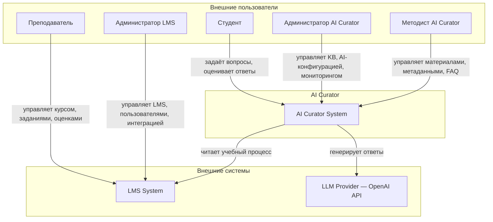
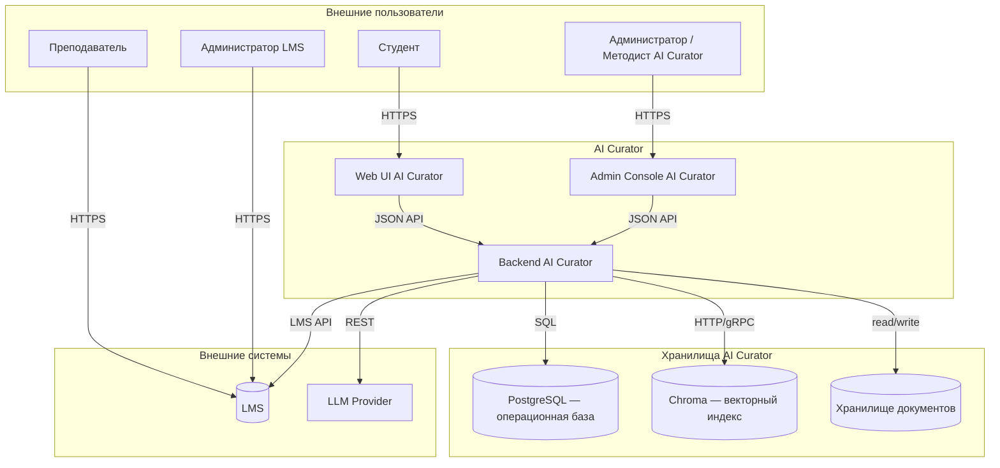
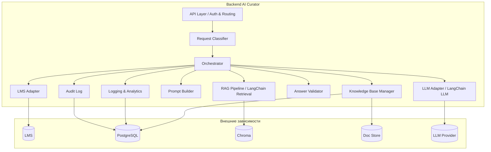
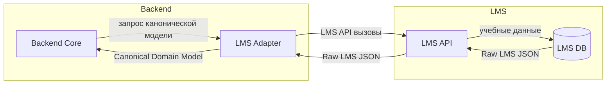
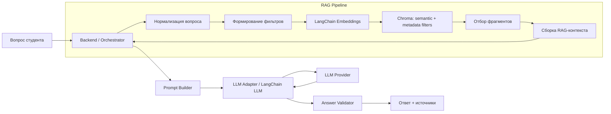
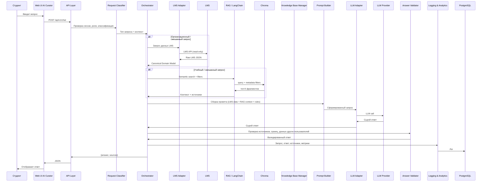
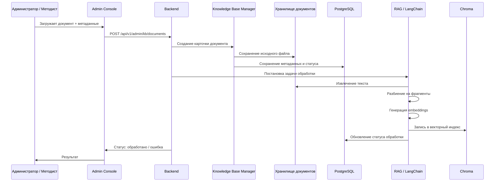
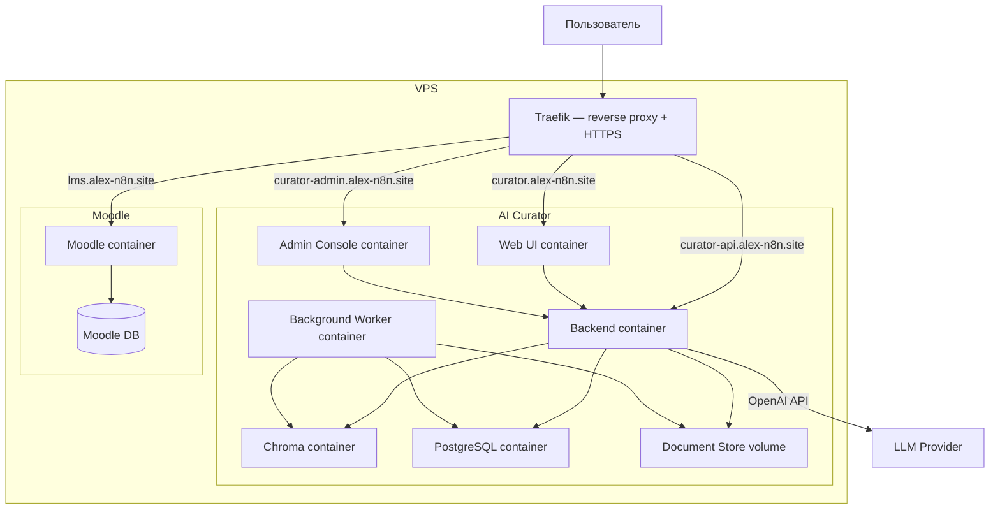

# ARCHITECTURE.md — AI Curator

**Проект:** ai-curator
**Версия:** 2.0
**Дата:** 2026-07-29
**Статус:** Approved

---

## 1. Архитектурные принципы

AI Curator — самостоятельная подсистема образовательной платформы, развёрнутая на VPS.

Ключевые принципы:

- **Backend AI Curator — единый оркестратор** всех пользовательских и административных сценариев.
- **Два независимых источника данных:**
  - **LMS** — Source of Truth учебного процесса.
  - **Knowledge Base AI Curator** — самостоятельный источник учебных материалов.
- **LangChain используется только внутри Backend** как библиотека для RAG и вызовов LLM.
- **LMS Adapter** — внутренний компонент Backend, изолирующий AI Curator от деталей LMS API.
- **Web UI AI Curator** — отдельный публичный сервис на VPS, доступный по собственному HTTPS.
- **Пользовательские интерфейсы не обращаются напрямую** к LMS, Knowledge Base, векторному индексу или LLM.
- **Векторный индекс** — производное хранилище, восстанавливаемое из документов Knowledge Base.
- **Параметры промптов и retrieval** (system prompt, output rules, few-shot, distance threshold, top-k и др.) управляются через Admin Console и таблицу `ai_configs`, а не захардкожены в коде.

---

## 2. Context Diagram (C4 Level 1)

---

## 3. Container Diagram (C4 Level 2)

---

## 4. Component Diagram (C4 Level 3 — Backend)

---

## 5. Границы ответственности

### 5.1. LMS

| Аспект | LMS | AI Curator |
|--------|-----|------------|
| Source of Truth учебного процесса | ✅ | ❌ только read-through |
| Пользователи, роли, группы | ✅ | ❌ только читает разрешённое |
| Курсы, модули, темы | ✅ | ❌ только читает разрешённое |
| Задания, тесты, дедлайны | ✅ | ❌ только читает разрешённое |
| Расписание | ✅ | ❌ не изменяет |
| Оценки, прогресс, статусы | ✅ | ❌ только читает разрешённое |

### 5.2. Knowledge Base AI Curator

Knowledge Base — самостоятельная продуктовая сущность AI Curator, не являющаяся частью LMS.

| Компонент | Роль | Source of Truth |
|-----------|------|-----------------|
| Исходные документы (лекции, методички, FAQ) | ✅ Хранилище документов | ✅ Knowledge Base |
| Метаданные документов | ✅ PostgreSQL | ✅ Knowledge Base |
| Версии и история изменений | ✅ PostgreSQL | ✅ Knowledge Base |
| Векторный индекс (Chroma) | ❌ Производное хранилище | ❌ |

### 5.3. Backend AI Curator

Backend отвечает за:

- приём и авторизацию запросов;
- классификацию запроса;
- получение данных из LMS через LMS Adapter;
- retrieval по Knowledge Base через LangChain;
- сборку промпта;
- вызов LLM через LangChain;
- проверку и оформление ответа;
- логирование, аналитику, аудит;
- административное API для Knowledge Base и AI-конфигурации.

---

## 6. LMS Adapter

LMS Adapter — внутренний компонент Backend.

**Ответственность:**

- аутентификация и авторизация в LMS API;
- выполнение вызовов к LMS API;
- преобразование ответов LMS во внутренние модели Backend;
- нормализация курсов, модулей, заданий, сроков и прогресса;
- обработка ошибок и недоступности LMS;
- гарантия read-only доступа.

**Ограничения:**

- не содержит RAG-логики;
- не обращается к LLM;
- не управляет Knowledge Base.

---

## 7. Knowledge Base и RAG Pipeline

### 7.1. Состав Knowledge Base

Минимальный состав:

- лекции;
- методические материалы;
- FAQ.

Дополнительно допускается:

- инструкции;
- глоссарии;
- примеры решений;
- справочные материалы;
- рекомендованные внешние ресурсы;
- пояснения преподавателей;
- материалы для разных уровней подготовки.

### 7.2. Метаданные материала

- идентификатор;
- название;
- тип материала;
- курс (course_id);
- модуль (module_id);
- тема (topic_id);
- уровень сложности;
- язык;
- версия;
- статус публикации;
- дата добавления;
- дата обновления;
- ссылка или идентификатор исходного документа.

### 7.3. RAG Pipeline внутри Backend

RAG Pipeline отвечает только за retrieval, reranking и подготовку RAG-контекста. RAG Pipeline не обращается к LLM напрямую. Единственный вызов модели выполняется через LLM Adapter после сборки промпта в Prompt Builder.

---

## 8. Runtime Sequence — пользовательский запрос

---

## 9. Data Flow — добавление материала в Knowledge Base

---

## 10. Deployment Diagram

---

## 11. Prompt Architecture

### 11.1. Состав prompt

| Часть | Назначение |
|-------|------------|
| System Prompt | Роль AI Curator, запреты, стиль |
| User Context | Курс, модуль, тема, уровень подготовки |
| LMS Data | Дедлайны, задания, прогресс из LMS (если нужно) |
| RAG Context | Найденные фрагменты Knowledge Base |
| Few-shot | Корректные и некорректные примеры ответов |
| User Question | Вопрос студента |
| Output Rules | Требования к структуре, ссылкам, отказу |

### 11.2. System Prompt — ключевые правила

- AI — наставник, отвечает в поддерживающем стиле.
- Запрещено выставлять оценки.
- Запрещено изменять расписание, дедлайны, задания, курсы.
- Каждый факт должен сопровождаться ссылкой на источник или явным сообщением о недостатке данных.
- Если информации недостаточно, AI честно признаёт это и предлагает обратиться к преподавателю.

---

## 12. Logging, Analytics и Audit

### 12.1. Что логируется

| Событие | Данные | Хранение | Retention |
|---------|--------|----------|-----------|
| Запрос студента | Текст, session_id, курс, уровень, lms_calls, rag_filters | PostgreSQL `chat_requests` | 30 дней в hot storage |
| Классификация | Тип запроса | PostgreSQL `chat_requests.intent` | 30 дней |
| LMS call | Endpoint, статус, latency | PostgreSQL `chat_requests.lms_calls` | 30 дней |
| RAG query | Запрос, фильтры, количество чанков | PostgreSQL `analytics_events` | 30 дней |
| LLM call metadata | Модель, токены, задержка, статус, trace_id | PostgreSQL `llm_calls` | 30 дней |
| LLM call trace | Полный prompt и response | PostgreSQL `llm_call_traces` | 7 дней |
| Ответ AI | Текст, источники, модель | PostgreSQL `chat_logs` | 30 дней |
| Latency trace | Разбивка по компонентам (intent, LMS, RAG, LLM, validation) | PostgreSQL `analytics_events.payload.timings_ms` | 30 дней |
| Оценка полезности | Оценка, комментарий | PostgreSQL `chat_logs.feedback_score` | 30 дней |
| Административное действие | Действие, пользователь, изменения | PostgreSQL `audit_logs` | 30 дней |
| Ошибка | Тип, трассировка, контекст | PostgreSQL `chat_logs.error` | 30 дней |

### 12.2. Retention и архивирование

Hot storage PostgreSQL хранит логи 30 дней. Полные prompt/response (`llm_call_traces`) хранятся 7 дней.

Фоновый cleanup job (`main.py::_retention_cleanup_loop`) раз в сутки:
1. Экспортирует устаревшие записи в gzip-архивы (`jsonl.gz`) в `archive_dir`.
2. Загружает записи в локальное хранилище `/app/storage/archives/` (по умолчанию).
3. Удаляет устаревшие записи из PostgreSQL.

Путь и сроки retention настраиваются переменными окружения:
- `ARCHIVE_DIR`
- `HOT_RETENTION_DAYS` (по умолчанию 30)
- `TRACE_RETENTION_DAYS` (по умолчанию 7)

### 12.3. Аналитика

Admin Console отображает:

- количество запросов;
- темы вопросов;
- частые вопросы;
- вопросы без ответа;
- использованные источники;
- оценку полезности;
- задержку обработки (общая и по компонентам из `analytics_events.payload.timings_ms`);
- ошибки;
- динамику обращений по курсам и модулям.

---

## 13. Модель авторизации

### 13.1. Доступ к LMS

- LMS Adapter использует LMS API.
- Аутентификация через токен или OAuth2-сервис из переменных окружения.
- Права аккаунта ограничены read-only операциями.

### 13.2. Доступ к Admin Console

- Bearer token или аутентификация по логину/паролю.
- Ролевая модель: администратор AI Curator, методист AI Curator.
- Токен хранится в переменных окружения.

### 13.3. Web UI студента

- Гостевой доступ или аутентификация через Moodle OAuth.
- Студент видит только собственные данные и курсы.

---

## 14. Основные архитектурные решения

| Решение | Реализация |
|---------|------------|
| Backend — единый оркестратор | FastAPI-приложение координирует все компоненты: LMS Adapter, RAG, Prompt Builder, LLM Adapter, Answer Validator, Logging, Analytics, Audit |
| LangChain — библиотека внутри Backend | Используется только для Document Loaders, Chunking, Embeddings, Retrieval, Prompt Assembly и вызовов LLM |
| LMS — Source of Truth учебного процесса | Все учебные данные берутся из LMS API через LMS Adapter |
| Knowledge Base — самостоятельный источник знаний | Управляется через Admin Console, хранит документы, метаданные, версии; векторный индекс производный |
| LMS Adapter | Внутренний компонент Backend, изолирует AI Curator от LMS API |
| Read-only интеграция с LMS | Адаптер не выполняет операции записи |
| Web UI AI Curator | Отдельный публичный сервис на VPS с HTTPS, не встраивается в LMS |
| Admin Console AI Curator | Отдельный публичный административный интерфейс |
| HTTPS для всех сервисов | Traefik + Let's Encrypt |
| Пользовательские интерфейсы не обращаются напрямую к источникам | Все внешние обращения маршрутизируются через Backend |

---

## 15. Открытые архитектурные вопросы

| Вопрос | Категория | Примечание |
|--------|-----------|------------|
| Стек Web UI / Admin Console | Frontend | React / vanilla / другой |
| Модель аутентификации студента | Безопасность | Гостевой доступ vs Moodle OAuth |
| LLM-провайдер | AI | OpenAI / другой |
| Хранилище документов Knowledge Base | Инфраструктура | Object Storage / файловая система |
| Фоновая обработка документов | Эксплуатация | Worker внутри Backend / отдельный worker-контейнер |
| Размер фрагментов и стратегия разбиения | RAG | Экспериментально |

---

## 16. История изменений

| Дата | Версия | Изменения |
|------|--------|-----------|
| 2026-07-29 | 2.0 | Пересоздан ARCHITECTURE.md на основе AI_CURATOR_SYSTEM_SPECIFICATION.md: C4 Context/Container/Component диаграммы, Runtime Sequence, Data Flow, Deployment, разделение LMS и Knowledge Base, Backend как единый оркестратор |
| 2026-07-29 | 2.0 (Approved) | Документ согласован куратором. Статус изменён на Approved. Исправлено архитектурное противоречие: RAG Pipeline не обращается к LLM напрямую, единственный вызов модели выполняется через LLM Adapter. |
| 2026-07-29 | 1.0 | Первая версия ARCHITECTURE.md |
| 2026-07-30 | 2.1 | Добавлены разделы retention и архивирования логов; параметризация промптов через `ai_configs`; детальная разбивка latency в analytics events |
