# IMPLEMENTATION_PLAN.md — AI Curator

**Проект:** ai-curator
**Версия:** 2.0
**Дата:** 2026-07-29
**Статус:** Approved
**Срок реализации:** 7 календарных дней

---

## 1. Обзор плана

### 1.1. Source of Truth

| Документ | Назначение |
|----------|------------|
| `AI_CURATOR_SYSTEM_SPECIFICATION.md` | Концепция системы, первичный Source of Truth |
| `docs/PROJECT_STATE.md` | Решения владельца / куратора |
| `docs/SPEC.md` | Продуктовая спецификация |
| `docs/ARCHITECTURE.md` | Архитектурные решения |

### 1.2. Цель семидневного цикла

Получить полностью развёрнутый публичный сервис AI Curator на VPS с HTTPS-эндпоинтами:

- LMS (Moodle) доступна по HTTPS;
- Backend AI Curator работает и интегрирован с LMS API через LMS Adapter;
- Knowledge Base AI Curator управляется через Admin Console;
- RAG-конвейер через LangChain внутри Backend отвечает по учебным материалам;
- Web UI AI Curator — отдельный публичный сервис, позволяет студенту задать вопрос и получить ответ с источниками;
- Admin Console позволяет загружать материалы, управлять метаданными, запускать индексацию, просматривать аналитику и мониторинг;
- Логирование, аналитика и аудит работают;
- Проведено E2E-тестирование ключевых сценариев.

### 1.3. Критерии завершения семидневного цикла

- [x] LMS (Moodle) развёрнута на VPS и доступна по HTTPS.
- [x] В LMS подготовлен курс с модулями, заданиями, дедлайнами и тестовыми ролями.
- [x] Backend AI Curator работает и подключён к LMS API, Chroma и PostgreSQL.
- [x] Knowledge Base содержит учебные материалы (лекции, методички, FAQ), загруженные через Admin Console. (Sprint 4.1)
- [x] RAG индексирует материалы Knowledge Base и отвечает по ним. (Sprint 4.2)
- [x] Web UI AI Curator развёрнут как отдельный публичный сервис на VPS и доступен по HTTPS.
- [x] Admin Console позволяет загружать материалы, управлять версиями и метаданными, запускать индексацию, просматривать аналитику.
- [x] Логирование, аналитика и аудит работают.
- [ ] Проведено E2E-тестирование ключевых сценариев.
- [ ] Подготовлены DEPLOYMENT_GUIDE.md и материалы для портфолио.

---

## 2. Диаграмма этапов

```mermaid
flowchart LR
    D1[День 1: VPS + Moodle + сеть] --> D2[День 2: Курс и роли в LMS]
    D2 --> D3[День 3: Backend scaffold + LMS Adapter]
    D3 --> D4[День 4: Knowledge Base + RAG через LangChain]
    D4 --> D5[День 5: Web UI студента]
    D5 --> D6[День 6: Admin Console + логи/аналитика]
    D6 --> S6_1[Sprint 6.1: Configurable Orchestrator Routing]
    S6_1 --> D7[День 7: E2E + деплой + документация]
```



### 2.1. Критический путь

```
День 1 (VPS + Moodle) → День 2 (Курс + роли) → День 3 (Backend + LMS Adapter)
                                                             ↓
День 4 (Knowledge Base + RAG) → День 5 (Web UI) → День 6 (Admin Console) → Sprint 6.1 (Orchestrator Config) → День 7 (E2E + деплой)
```

---

## 3. День 1: Инфраструктура VPS, Moodle и сеть

### Цель

Подготовить VPS, настроить Docker-окружение, развернуть Moodle LMS и обеспечить доступ по HTTPS.

### Результат дня

| Артефакт | Признак готовности |
|----------|-------------------|
| VPS подготовлен | SSH-доступ, Docker и Docker Compose установлены |
| Moodle развёрнута | `https://lms.alex-n8n.site` открывается без ошибок |
| HTTPS работает | SSL-сертификат валиден |
| Базовая сеть настроена | Docker-сеть между сервисами работает |
| `.env.example` подготовлен | Плейсхолдеры секретов и доменов |

### Задачи

1. Зарезервировать VPS и домены.
2. Установить Docker, Docker Compose, настроить firewall.
3. Развернуть Moodle через Docker Compose.
4. Настроить Traefik или nginx с Let's Encrypt для HTTPS.
5. Провести первоначальную настройку Moodle.
6. Подготовить `.env.example` для инфраструктуры.

### Критерий завершения

- [x] Moodle доступна по HTTPS.
- [x] Можно войти в Moodle администратором.
- [x] `docker compose ps` показывает healthy-контейнеры.

---

## 4. День 2: Подготовка курса и тестовых ролей в LMS

### Цель

Создать в Moodle учебный курс с модулями, заданиями и дедлайнами; настроить тестовые роли.

### Результат дня

| Артефакт | Признак готовности |
|----------|-------------------|
| Курс создан | ✅ В Moodle есть курс «Claude Code: от знакомства до автоматизации» (AI Skills Lab, id: 3, shortname: `claude-code-express`) |
| Модули добавлены | ✅ 3 модуля с уроками |
| Задания с дедлайнами | ✅ 9 заданий с указанными дедлайнами, привязанных к урокам через idnumber |
| Тестовые роли | ✅ Студент, преподаватель, менеджер курса созданы и записаны на курс |
| API-токен read-only | ✅ Создан технический пользователь `ai_curator_service` с системной ролью manager и токеном |
| Уроки с кратким содержанием | ✅ Для каждого урока (Page) добавлен intro и content |
| Обратная связь | ✅ 3 формы Feedback с анкетой по десятибалльной шкале |

### Задачи

1. ✅ Создать курс и структуру модулей.
2. ✅ Создать задания с дедлайнами.
3. ✅ Создать пользователей: student_demo, teacher_demo, moodle_admin_demo.
4. ✅ Назначить роли на курс.
5. ✅ Включить Moodle Web Services, создать роль и токен для read-only API.
6. ✅ Зафиксировать примеры данных для E2E-тестирования.
7. ✅ Добавить краткие описания и содержание для уроков.
8. ✅ Настроить формы обратной связи по образцу Zeroкодера.

### Критерий завершения

- [x] Студент видит курс, модули, материалы и задания.
- [x] Преподаватель может редактировать курс.
- [x] Дедлайны отображаются корректно.
- [x] API-токен read-only создан и протестирован.
- [x] Уроки содержат краткое описание и навигационное содержание.
- [x] Обратная связь настроена и содержит вопросы по десятибалльной шкале.

---

## 5. День 3: Backend scaffold и LMS Adapter

### Цель

Подготовить каркас Backend, реализовать LMS Adapter, базовые endpoints и интеграцию с LMS API.

### Результат дня

| Артефакт | Признак готовности |
|----------|-------------------|
| Backend scaffold | FastAPI приложение запускается в Docker |
| PostgreSQL подключена | Миграции применены |
| LMS Adapter | Backend получает курсы, модули, задания, дедлайны, прогресс в канонической модели |
| Health endpoints | `/health`, `/health/lms`, `/health/db`, `/health/chroma` отвечают |
| Базовые API | `GET /api/v1/courses`, `GET /api/v1/courses/{id}/deadlines`, `GET /api/v1/me/progress` |
| API-контракт | `docs/API_CONTRACT.md` содержит описание endpoint'ов |
| Тесты | `pytest` проходит (health, courses, deadlines, progress) |

### Задачи

1. Создать backend на FastAPI: структура, модели, миграции Alembic.
2. Реализовать LMS Adapter внутри Backend: аутентификация, получение курсов, модулей, заданий, материалов, прогресса; преобразование Raw LMS JSON в Canonical Domain Model.
3. Подключить PostgreSQL.
4. Реализовать health endpoints.
5. Реализовать endpoint для получения дедлайнов и прогресса.

### Критерий завершения

- [x] `GET /health/lms` возвращает статус OK.
- [x] `GET /api/v1/courses` возвращает список курсов из LMS.
- [x] `GET /api/v1/courses/{id}/deadlines` возвращает дедлайны.
- [x] `GET /api/v1/me/progress` возвращает прогресс текущего студента.
- [x] `GET /health/chroma` возвращает статус OK.
- [x] `pytest` проходит.

---

## 6. День 4: Knowledge Base и RAG через LangChain в Backend

День 4 разбит на два спринта, чтобы каждый завершался работающим инкрементом.

### 6.1. Sprint 4.1: Knowledge Base scaffold и Admin API ✅

#### Цель

Реализовать управление документами Knowledge Base: загрузку, версионирование, публикацию, хранение метаданных в PostgreSQL и файлов в хранилище.

#### Результат спринта

| Артефакт | Признак готовности |
|----------|-------------------|
| SQLAlchemy-модели | `KbDocument`, `KbDocumentVersion`, `KbDocumentChunk` |
| Alembic-миграция | Таблицы KB созданы в PostgreSQL |
| Файловое хранилище | `DOC_STORE_PATH` — volume `/app/storage/documents` |
| Admin API | `POST /api/v1/admin/kb/documents`, `GET /api/v1/admin/kb/documents`, `GET /api/v1/admin/kb/documents/{id}`, `PUT /api/v1/admin/kb/documents/{id}`, `DELETE /api/v1/admin/kb/documents/{id}`, `POST /api/v1/admin/kb/documents/{id}/versions`, `POST /api/v1/admin/kb/documents/{id}/publish`, `GET /api/v1/admin/kb/status` |
| API-контракт | `docs/API_CONTRACT.md` обновлён разделом Knowledge Base |
| Тесты | `tests/test_kb.py` — 4 теста проходят |

#### Критерий завершения

- [x] Можно загрузить документ в Knowledge Base через API.
- [x] Метаданные документа сохраняются в PostgreSQL.
- [x] Можно получить список документов и карточку документа.
- [x] Можно опубликовать / снять с публикации документ.
- [x] `pytest` проходит.

---

### 6.2. Sprint 4.2: RAG pipeline ✅

#### Цель

Реализовать обработку документов: извлечение текста, chunking, embeddings, индексацию в Chroma и семантический поиск.

#### Результат спринта

| Артефакт | Признак готовности |
|----------|-------------------|
| LangChain Document Loader | Markdown / PDF преобразуются в текст |
| LangChain Chunker | Документы разбиваются на фрагменты с метаданными |
| Chroma интегрирована | Векторы сохраняются и извлекаются |
| RAG endpoint | `POST /api/v1/rag/search` возвращает релевантные фрагменты |
| Processing endpoint | `POST /api/v1/admin/kb/documents/{id}/process` запускает обработку |

#### Критерий завершения

- [x] Обработка создаёт фрагменты и embeddings.
- [x] Chroma содержит фрагменты с метаданными.
- [x] `POST /api/v1/rag/search` возвращает релевантные результаты.
- [x] Старая версия документа исключается из активного индекса при публикации новой версии.
- [x] `pytest` проходит.

---

## 7. День 5: Web UI студента ✅

### Цель

Реализовать отдельный публичный Web UI AI Curator для диалога со студентами.

### Результат дня

| Артефакт | Признак готовности |
|----------|-------------------|
| Web UI собирается | `npm run build` или аналог проходит без ошибок |
| Chat работает | Можно отправить вопрос и получить ответ |
| Источники отображаются | Под ответом есть ссылки на материалы Knowledge Base или задания LMS |
| Переключатель сложности | Есть выбор уровня подготовки |
| HTTPS-доступ | `https://curator.alex-n8n.site` открывается |
| Демо-доступ | Гостевой вход с выбором демо-роли, без пароля |

### Задачи

1. Реализовать frontend Web UI (React / vanilla — по решению дня 0).
2. Подключить API backend: отправка вопроса, получение ответа, история диалога.
3. Реализовать отображение источников.
4. Реализовать переключатель уровня сложности.
5. Реализовать оценку полезности ответа.
6. **Реализовать гостевой демо-вход с выбором роли:**
   - роли: `active_student`, `late_student`, `new_student`;
   - каждая роль отображает подготовленный сценарий прогресса/дедлайнов;
   - без пароля, с сохранением сессии в localStorage / cookie.
7. Настроить сборку и развёртывание через Docker / nginx.
8. Развернуть Web UI на VPS с HTTPS как отдельный публичный сервис.

### Критерий завершения

- [x] Студент может задать вопрос и получить ответ.
- [x] Ответ содержит ссылку на источник.
- [x] Переключатель сложности влияет на фильтры RAG search.
- [x] Web UI доступен по HTTPS на собственном домене.
- [x] Гостевой демо-вход с выбором роли работает без пароля.

---

## 8. День 6: LLM Chat, Admin Console, Logging, Analytics и Audit

### Цель

Реализовать LLM-оркестратор чата в Backend, интегрировать его с Web UI и создать Admin Console для управления Knowledge Base, AI-конфигурацией, аналитикой и мониторингом.

### Результат дня

| Артефакт | Признак готовности |
|----------|-------------------|
| LLM Chat endpoint | `POST /api/v1/chat` возвращает сформированный LLM-ответ с источниками |
| Prompt Builder | Промпт собирается из RAG-контекста, LMS-данных и системных инструкций |
| LLM Adapter | Вызов `gpt-4o-mini` через LangChain внутри Backend |
| Answer Validator | Проверка наличия источников и границ ответа |
| Web UI chat обновлён | Web UI использует `POST /api/v1/chat` вместо прямого `/rag/search` |
| Admin Console собирается | Сборка проходит без ошибок |
| Управление KB | Можно загрузить документ, указать метаданные, запустить обработку, опубликовать |
| Версионирование | Можно загрузить новую версию и заменить старую в индексе |
| AI Configuration | Можно изменить системные инструкции, модель, параметры retrieval |
| Аналитика | Доступны частые темы, вопросы без ответа, популярные материалы, оценки, задержки |
| Мониторинг | Отображается состояние Backend, LMS, Knowledge Base, LLM |
| HTTPS-доступ | `https://curator-admin.alex-n8n.site` открывается |

### Задачи

1. **LLM Chat в Backend:**
   - Реализовать `src/services/prompt_builder.py` — сборка промпта из RAG-контекста, LMS-данных, роли и difficulty.
   - Реализовать `src/services/llm_adapter.py` — вызов OpenAI через LangChain `ChatOpenAI`.
   - Реализовать `src/services/answer_validator.py` — проверка источников и границ.
   - Реализовать `src/services/orchestrator.py` — классификация запроса, вызов LMS Adapter / RAG Pipeline, сборка ответа.
   - Реализовать `POST /api/v1/chat` в `src/api/v1/chat.py`.
2. **Обновить Web UI:**
   - Переключить `useChat` на `POST /api/v1/chat`.
   - Добавить рендеринг markdown-ответов.
   - Сохранять историю диалога в `localStorage`.
3. **Реализовать Admin Console frontend.**
4. **Реализовать admin endpoints**:
   - `/api/v1/admin/kb/documents` — CRUD документов;
   - `/api/v1/admin/kb/documents/{id}/process` — обработка;
   - `/api/v1/admin/kb/documents/{id}/publish` — публикация / снятие;
   - `/api/v1/admin/kb/status` — состояние Knowledge Base;
   - `/api/v1/admin/ai-config` — конфигурация AI;
   - `/api/v1/admin/analytics` — аналитика;
   - `/api/v1/admin/monitoring` — мониторинг;
   - `/api/v1/admin/logs` — логи;
   - `/api/v1/admin/audit` — аудит.
5. Настроить логирование запросов в PostgreSQL.
6. Реализовать агрегацию аналитики по темам, модулям, курсам.
7. Реализовать мониторинг состояния компонентов.
8. Настроить аутентификацию и авторизацию администраторов / методистов.
9. Развернуть Admin Console и обновлённый Web UI на VPS с HTTPS.

### Критерий завершения

- [x] `POST /api/v1/chat` возвращает осмысленный ответ с источниками.
- [x] Web UI использует `/api/v1/chat` и отображает markdown-ответы.
- [x] Документ загружается и индексируется из Admin Console.
- [x] Можно опубликовать / снять с публикации документ.
- [x] AI-конфигурация версионируется и применяется.
- [x] Запросы студентов записываются в логи.
- [x] Аналитика по темам доступна.
- [x] Мониторинг состояния системы доступен.
- [x] Admin Console доступен по HTTPS.

---

## 9. Sprint 6.1: Configurable Orchestrator Routing

### Цель

Вынести хардкодированную логику маршрутизации запросов из `orchestrator.py` в конфигурируемую настройку `orchestrator_configs`, управляемую через отдельную консоль Admin Console.

### Результат спринта

| Артефакт | Признак готовности |
|----------|-------------------|
| Модель БД | Таблица `orchestrator_configs` с JSON-полями |
| Миграция | `alembic/versions/20260731h_add_orchestrator_config.py` применена |
| Сервис | `OrchestratorConfigService` читает и обновляет конфигурацию |
| Admin API | `GET/PUT /api/v1/admin/orchestrator/config` доступны и валидированы |
| Интеграция | `orchestrator.py` использует конфиг для intent, source map, token budgets, fallback messages |
| Prompt Builder | `prompt_builder.py` читает `max_lms_contents`/`max_lms_deadlines` из конфига |
| Admin Console UI | Пункт меню «Orchestrator» и страница настроек работают |
| Тесты | `test_orchestrator_config.py` + обновлённые `test_chat.py` проходят |
| Документация | `ARCHITECTURE.md`, `API_CONTRACT.md`, `OPERATIONS.md`, `README.md` актуализированы |

### Задачи

1. Создать `src/models/orchestrator_config.py` с JSON-полями и defaults, идентичными текущему хардкоду.
2. Создать `src/services/orchestrator_config.py` с `get_or_create_default()` и `update()`.
3. Создать Alembic-миграцию для таблицы `orchestrator_configs`.
4. Создать `src/api/v1/admin/orchestrator_config.py` с `GET`/`PUT` и Pydantic-схемами.
5. Подключить роутер в `src/api/v1/admin/__init__.py`.
6. Адаптировать `src/services/orchestrator.py`:
   - загружать конфигурацию;
   - использовать `intent_rules` в `detect_intent()`;
   - использовать `intent_source_map` для `need_lms`/`need_rag`/`strict_course_rag`;
   - использовать `intent_max_tokens`;
   - использовать `fallback_messages`;
   - использовать `non_course_starters`.
7. Адаптировать `src/services/prompt_builder.py` для `max_lms_contents`/`max_lms_deadlines`.
8. Создать `admin-console/src/components/OrchestratorConfig.jsx` с секциями Intent, Source Routing, Limits, Token Budgets, Fallbacks.
9. Добавить пункт меню в `admin-console/src/components/Sidebar.jsx`.
10. Подключить компонент в `admin-console/src/App.jsx`.
11. Добавить API-функции в `admin-console/src/api/backend.js`.
12. Написать/обновить тесты.
13. Актуализировать `docs/API_CONTRACT.md`, `docs/OPERATIONS.md`, `docs/ARCHITECTURE.md`, `README.md`.

### Критерий завершения

- [ ] Конфигурация оркестратора доступна через Admin API и Admin Console.
- [ ] Изменение `intent_rules` через API влияет на классификацию запросов.
- [ ] Изменение `intent_source_map` влияет на выбор источников.
- [ ] При отсутствии конфигурации orchestrator работает с hardcoded defaults.
- [ ] `pytest` проходит.

---

## 10. День 7: E2E-тестирование, деплой и документация

### Цель

Провести сквозное тестирование, задеплоить все сервисы, подготовить документацию и материалы для портфолио.

### Результат дня

| Артефакт | Признак готовности |
|----------|-------------------|
| E2E-тесты пройдены | Все сценарии из SPEC работают |
| Все сервисы доступны по HTTPS | Web UI, Admin Console, Backend API, Moodle |
| DEPLOYMENT_GUIDE.md | Инструкция по развёртыванию с нуля |
| README актуален | Содержит актуальные домены и инструкции |
| Portfolio presentation | Подготовлено описание кейса для портфолио |

### Задачи

1. Провести E2E-тесты:
   - организационный вопрос о дедлайне;
   - учебный вопрос с ответом из Knowledge Base;
   - смешанный вопрос с персональной рекомендацией;
   - запрос о собственном прогрессе;
   - недостаток данных — честный отказ;
   - загрузка и индексация материала в Knowledge Base;
   - обновление версии документа;
   - снятие материала с публикации;
   - управление AI-конфигурацией;
   - просмотр аналитики и мониторинга.
2. Исправить выявленные дефекты.
3. Подготовить `DEPLOYMENT_GUIDE.md`.
4. Актуализировать README.
5. Подготовить материалы для портфолио.
6. Сделать финальный деплой.

### Критерий завершения

- [ ] Все сценарии SPEC работают в production-like окружении.
- [ ] Все сервисы доступны по HTTPS.
- [ ] DEPLOYMENT_GUIDE.md позволяет понять, как развернуть проект.
- [ ] README отражает актуальное состояние.

---

## 11. Зависимости и критический путь

### 11.1. Внешние зависимости

| Зависимость | Описание | Митигация |
|-------------|----------|-----------|
| VPS и домены | Нужны для публичного деплоя | Зарезервировать заранее |
| Moodle | Source of Truth учебного процесса | Развернуть на том же VPS или отдельном контейнере |
| LLM API | Необходим для генерации ответов | Иметь запасной ключ / fallback |
| OpenAI API | Эмбеддинги и LLM | Мониторить лимиты и стоимость |
| Knowledge Base content | Необходимы учебные материалы для RAG | Подготовить методистский контент заранее |

### 11.2. Внутренние зависимости

| Этап | Зависит от | Почему |
|------|------------|--------|
| День 2 | День 1 | Нужен развёрнутый Moodle |
| День 3 | День 2 | Нужен курс и API-токен |
| День 4 | День 3 | Нужен backend и LMS Adapter |
| День 5 | День 4 | Нужен работающий RAG |
| День 6 | День 5 | Нужен Web UI для получения логов |
| Sprint 6.1 | День 6 | Нужен работающий chat/orchestrator |
| День 7 | Sprint 6.1 | Нужен полный контур и конфигурация оркестратора для E2E |

### 11.3. Критический путь

```
День 1 → День 2 → День 3 → День 4 → День 5 → День 6 → Sprint 6.1 → День 7
```

Задержка на любом из дней сдвигает финальный деплой.

---

## 12. Риски и митигация

| Риск | Вероятность | Влияние | Митигация |
|------|-------------|--------|-----------|
| Проблемы с Moodle API | Средняя | Высокое | Подготовить read-only роль, проверять права |
| Высокая стоимость LLM | Средняя | Среднее | Ограничить max_tokens, кэшировать частые запросы |
| Некорректные ответы AI | Средняя | Высокое | RAG + источники + few-shot + answer validation + логирование |
| Сложности с HTTPS/доменами | Низкая | Среднее | Использовать проверенную схему Traefik + Let's Encrypt |
| Перегрузка VPS | Средняя | Среднее | Минимизировать контейнеры, мониторить ресурсы |
| Наполнение Knowledge Base | Средняя | Высокое | Подготовить методистский процесс и контент заранее |

---

## 13. Документация, создаваемая в ходе реализации

| Документ | День | Назначение |
|----------|------|------------|
| `DEPLOYMENT_GUIDE.md` | День 7 | Source of Truth развёртывания |
| `docs/API_CONTRACT.md` | День 3–6, Sprint 6.1 | Контракты API |
| `docs/PROMPT_ARCHITECTURE.md` | День 6 | Структура промптов и few-shot примеры |
| `docs/OPERATIONS.md` | День 6–7, Sprint 6.1 | Эксплуатация, обновление Knowledge Base и конфигурация оркестратора |
| `docs/ARCHITECTURE.md` | Sprint 6.1 | Архитектурные решения, включая конфигурируемую маршрутизацию |
| `README.md` | День 7 | Актуализация публичного описания |

---

## 14. История изменений

| Дата | Версия | Изменения |
|------|--------|-----------|
| 2026-07-29 | 2.0 | Пересоздан IMPLEMENTATION_PLAN.md на основе AI_CURATOR_SYSTEM_SPECIFICATION.md: Knowledge Base загружается через Admin Console, Web UI — отдельный публичный сервис на VPS, Backend как единый оркестратор |
| 2026-07-29 | 2.0 (Approved) | Документ согласован куратором. Статус изменён на Approved. |
| 2026-07-29 | 1.0 | Первая версия IMPLEMENTATION_PLAN на 7 дней |
| 2026-07-31 | 2.1 | Добавлен Sprint 6.1 «Configurable Orchestrator Routing»: вынесение интент-классификации, source routing, context limits, token budgets и fallback-сообщений в конфигурируемую подсистему `orchestrator_configs` с отдельной консолью Admin Console; обновлены диаграмма этапов, зависимости и критический путь |
