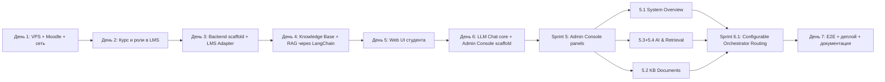

# IMPLEMENTATION_PLAN.md — AI Curator

**Проект:** ai-curator
**Версия:** 2.8
**Дата:** 2026-08-05
**Статус:** Approved
**Срок реализации:** 7+ календарных дней основного цикла + 9–15 календарных дней спринтов стабилизации и аналитики

---

## 1. Обзор плана

### 1.1. Source of Truth

| Документ | Назначение |
|----------|------------|
| `AI_CURATOR_SYSTEM_SPECIFICATION.md` | Концепция системы, первичный Source of Truth |
| `docs/PROJECT_STATE.md` | Решения владельца / куратора |
| `docs/SPEC.md` | Продуктовая спецификация |
| `docs/ARCHITECTURE.md` | Архитектурные решения |

### 1.2. Цель семидневного цикла

Получить полностью развёрнутый публичный сервис AI Curator на VPS с HTTPS-эндпоинтами:

- LMS (Moodle) доступна по HTTPS;
- Backend AI Curator работает и интегрирован с LMS API через LMS Adapter;
- Knowledge Base AI Curator управляется через Admin Console;
- RAG-конвейер через LangChain внутри Backend отвечает по учебным материалам;
- Web UI AI Curator — отдельный публичный сервис, позволяет студенту задать вопрос и получить ответ с источниками;
- Admin Console позволяет загружать материалы, управлять метаданными, запускать индексацию, просматривать аналитику и мониторинг;
- Логирование, аналитика и аудит работают;
- Проведено E2E-тестирование ключевых сценариев.

### 1.3. Критерии завершения семидневного цикла

- [x] LMS (Moodle) развёрнута на VPS и доступна по HTTPS.
- [x] В LMS подготовлен курс с модулями, заданиями, дедлайнами и тестовыми ролями.
- [x] Backend AI Curator работает и подключён к LMS API, Chroma и PostgreSQL.
- [x] Knowledge Base содержит учебные материалы (лекции, методички, FAQ), загруженные через Admin Console. (Sprint 4.1)
- [x] RAG индексирует материалы Knowledge Base и отвечает по ним. (Sprint 4.2)
- [x] Web UI AI Curator развёрнут как отдельный публичный сервис на VPS и доступен по HTTPS.
- [x] Admin Console позволяет загружать материалы, управлять версиями и метаданными, запускать индексацию, просматривать аналитику.
- [x] Логирование, аналитика и аудит работают.
- [ ] Проведено E2E-тестирование ключевых сценариев.
- [ ] Подготовлены DEPLOYMENT_GUIDE.md и материалы для портфолио.

---

## 2. Диаграмма этапов



### 2.1. Критический путь

```
День 1 (VPS + Moodle) → День 2 (Курс + роли) → День 3 (Backend + LMS Adapter)
                                                             ↓
День 4 (Knowledge Base + RAG) → День 5 (Web UI) → День 6 (LLM Chat + Admin Console scaffold)
                                                             ↓
Sprint 5.1 (Dashboard) → Sprint 5.3+5.4 (AI & Retrieval) → Sprint 5.2 (KB Documents) → Sprint 6.1 (Orchestrator Config) → День 7 (E2E + деплой)
```

---

## 3. День 1: Инфраструктура VPS, Moodle и сеть

### Цель

Подготовить VPS, настроить Docker-окружение, развернуть Moodle LMS и обеспечить доступ по HTTPS.

### Результат дня

| Артефакт | Признак готовности |
|----------|-------------------|
| VPS подготовлен | SSH-доступ, Docker и Docker Compose установлены |
| Moodle развёрнута | `https://lms.alex-n8n.site` открывается без ошибок |
| HTTPS работает | SSL-сертификат валиден |
| Базовая сеть настроена | Docker-сеть между сервисами работает |
| `.env.example` подготовлен | Плейсхолдеры секретов и доменов |

### Задачи

1. Зарезервировать VPS и домены.
2. Установить Docker, Docker Compose, настроить firewall.
3. Развернуть Moodle через Docker Compose.
4. Настроить Traefik или nginx с Let's Encrypt для HTTPS.
5. Провести первоначальную настройку Moodle.
6. Подготовить `.env.example` для инфраструктуры.

### Критерий завершения

- [x] Moodle доступна по HTTPS.
- [x] Можно войти в Moodle администратором.
- [x] `docker compose ps` показывает healthy-контейнеры.

---

## 4. День 2: Подготовка курса и тестовых ролей в LMS

### Цель

Создать в Moodle учебный курс с модулями, заданиями и дедлайнами; настроить тестовые роли.

### Результат дня

| Артефакт | Признак готовности |
|----------|-------------------|
| Курс создан | ✅ В Moodle есть курс «Claude Code: от знакомства до автоматизации» (AI Skills Lab, id: 3, shortname: `claude-code-express`) |
| Модули добавлены | ✅ 3 модуля с уроками |
| Задания с дедлайнами | ✅ 9 заданий с указанными дедлайнами, привязанных к урокам через idnumber |
| Тестовые роли | ✅ Студент, преподаватель, менеджер курса созданы и записаны на курс |
| API-токен read-only | ✅ Создан технический пользователь `ai_curator_service` с системной ролью manager и токеном |
| Уроки с кратким содержанием | ✅ Для каждого урока (Page) добавлен intro и content |
| Обратная связь | ✅ 3 формы Feedback с анкетой по десятибалльной шкале |

### Задачи

1. ✅ Создать курс и структуру модулей.
2. ✅ Создать задания с дедлайнами.
3. ✅ Создать пользователей: student_demo, teacher_demo, moodle_admin_demo.
4. ✅ Назначить роли на курс.
5. ✅ Включить Moodle Web Services, создать роль и токен для read-only API.
6. ✅ Зафиксировать примеры данных для E2E-тестирования.
7. ✅ Добавить краткие описания и содержание для уроков.
8. ✅ Настроить формы обратной связи по образцу Zeroкодера.

### Критерий завершения

- [x] Студент видит курс, модули, материалы и задания.
- [x] Преподаватель может редактировать курс.
- [x] Дедлайны отображаются корректно.
- [x] API-токен read-only создан и протестирован.
- [x] Уроки содержат краткое описание и навигационное содержание.
- [x] Обратная связь настроена и содержит вопросы по десятибалльной шкале.

---

## 5. День 3: Backend scaffold и LMS Adapter

### Цель

Подготовить каркас Backend, реализовать LMS Adapter, базовые endpoints и интеграцию с LMS API.

### Результат дня

| Артефакт | Признак готовности |
|----------|-------------------|
| Backend scaffold | FastAPI приложение запускается в Docker |
| PostgreSQL подключена | Миграции применены |
| LMS Adapter | Backend получает курсы, модули, задания, дедлайны, прогресс в канонической модели |
| Health endpoints | `/health`, `/health/lms`, `/health/db`, `/health/chroma` отвечают |
| Базовые API | `GET /api/v1/courses`, `GET /api/v1/courses/{id}/deadlines`, `GET /api/v1/me/progress` |
| API-контракт | `docs/API_CONTRACT.md` содержит описание endpoint'ов |
| Тесты | `pytest` проходит (health, courses, deadlines, progress) |

### Задачи

1. Создать backend на FastAPI: структура, модели, миграции Alembic.
2. Реализовать LMS Adapter внутри Backend: аутентификация, получение курсов, модулей, заданий, материалов, прогресса; преобразование Raw LMS JSON в Canonical Domain Model.
3. Подключить PostgreSQL.
4. Реализовать health endpoints.
5. Реализовать endpoint для получения дедлайнов и прогресса.

### Критерий завершения

- [x] `GET /health/lms` возвращает статус OK.
- [x] `GET /api/v1/courses` возвращает список курсов из LMS.
- [x] `GET /api/v1/courses/{id}/deadlines` возвращает дедлайны.
- [x] `GET /api/v1/me/progress` возвращает прогресс текущего студента.
- [x] `GET /health/chroma` возвращает статус OK.
- [x] `pytest` проходит.

---

## 6. День 4: Knowledge Base и RAG через LangChain в Backend

День 4 разбит на два спринта, чтобы каждый завершался работающим инкрементом.

### 6.1. Sprint 4.1: Knowledge Base scaffold и Admin API ✅

#### Цель

Реализовать управление документами Knowledge Base: загрузку, версионирование, публикацию, хранение метаданных в PostgreSQL и файлов в хранилище.

#### Результат спринта

| Артефакт | Признак готовности |
|----------|-------------------|
| SQLAlchemy-модели | `KbDocument`, `KbDocumentVersion`, `KbDocumentChunk` |
| Alembic-миграция | Таблицы KB созданы в PostgreSQL |
| Файловое хранилище | `DOC_STORE_PATH` — volume `/app/storage/documents` |
| Admin API | `POST /api/v1/admin/kb/documents`, `GET /api/v1/admin/kb/documents`, `GET /api/v1/admin/kb/documents/{id}`, `PUT /api/v1/admin/kb/documents/{id}`, `DELETE /api/v1/admin/kb/documents/{id}`, `POST /api/v1/admin/kb/documents/{id}/versions`, `POST /api/v1/admin/kb/documents/{id}/publish`, `GET /api/v1/admin/kb/status` |
| API-контракт | `docs/API_CONTRACT.md` обновлён разделом Knowledge Base |
| Тесты | `tests/test_kb.py` — 4 теста проходят |

#### Критерий завершения

- [x] Можно загрузить документ в Knowledge Base через API.
- [x] Метаданные документа сохраняются в PostgreSQL.
- [x] Можно получить список документов и карточку документа.
- [x] Можно опубликовать / снять с публикации документ.
- [x] `pytest` проходит.

---

### 6.2. Sprint 4.2: RAG pipeline ✅

#### Цель

Реализовать обработку документов: извлечение текста, chunking, embeddings, индексацию в Chroma и семантический поиск.

#### Результат спринта

| Артефакт | Признак готовности |
|----------|-------------------|
| LangChain Document Loader | Markdown / PDF преобразуются в текст |
| LangChain Chunker | Документы разбиваются на фрагменты с метаданными |
| Chroma интегрирована | Векторы сохраняются и извлекаются |
| RAG endpoint | `POST /api/v1/rag/search` возвращает релевантные фрагменты |
| Processing endpoint | `POST /api/v1/admin/kb/documents/{id}/process` запускает обработку |

#### Критерий завершения

- [x] Обработка создаёт фрагменты и embeddings.
- [x] Chroma содержит фрагменты с метаданными.
- [x] `POST /api/v1/rag/search` возвращает релевантные результаты.
- [x] Старая версия документа исключается из активного индекса при публикации новой версии.
- [x] `pytest` проходит.

---

## 7. День 5: Web UI студента ✅

### Цель

Реализовать отдельный публичный Web UI AI Curator для диалога со студентами.

### Результат дня

| Артефакт | Признак готовности |
|----------|-------------------|
| Web UI собирается | `npm run build` или аналог проходит без ошибок |
| Chat работает | Можно отправить вопрос и получить ответ |
| Источники отображаются | Под ответом есть ссылки на материалы Knowledge Base или задания LMS |
| Переключатель сложности | Есть выбор уровня подготовки |
| HTTPS-доступ | `https://curator.alex-n8n.site` открывается |
| Демо-доступ | Гостевой вход с выбором демо-роли, без пароля |

### Задачи

1. Реализовать frontend Web UI (React / vanilla — по решению дня 0).
2. Подключить API backend: отправка вопроса, получение ответа, история диалога.
3. Реализовать отображение источников.
4. Реализовать переключатель уровня сложности.
5. Реализовать оценку полезности ответа.
6. **Реализовать гостевой демо-вход с выбором роли:**
   - роли: `active_student`, `late_student`, `new_student`;
   - каждая роль отображает подготовленный сценарий прогресса/дедлайнов;
   - без пароля, с сохранением сессии в localStorage / cookie.
7. Настроить сборку и развёртывание через Docker / nginx.
8. Развернуть Web UI на VPS с HTTPS как отдельный публичный сервис.

### Критерий завершения

- [x] Студент может задать вопрос и получить ответ.
- [x] Ответ содержит ссылку на источник.
- [x] Переключатель сложности влияет на фильтры RAG search.
- [x] Web UI доступен по HTTPS на собственном домене.
- [x] Гостевой демо-вход с выбором роли работает без пароля.

---

## 8. День 6: LLM Chat core + Admin Console scaffold

### Цель

Реализовать LLM-оркестратор чата в Backend, интегрировать его с Web UI и подготовить каркас Admin Console. Детальные операционные панели Admin Console вынесены в отдельный **Sprint 5** (см. раздел 9).

### Результат дня

| Артефакт | Признак готовности |
|----------|-------------------|
| LLM Chat endpoint | `POST /api/v1/chat` возвращает сформированный LLM-ответ с источниками |
| Prompt Builder | Промпт собирается из RAG-контекста, LMS-данных и системных инструкций |
| LLM Adapter | Вызов `gpt-4o-mini` через LangChain внутри Backend |
| Answer Validator | Проверка наличия источников и границ ответа |
| Web UI chat обновлён | Web UI использует `POST /api/v1/chat` вместо прямого `/rag/search` |
| Admin Console собирается | Сборка проходит без ошибок |
| Управление KB | Можно загрузить документ, указать метаданные, запустить обработку, опубликовать |
| Версионирование | Можно загрузить новую версию и заменить старую в индексе |
| AI Configuration | Можно изменить системные инструкции, модель, параметры retrieval |
| Аналитика | Доступны частые темы, вопросы без ответа, популярные материалы, оценки, задержки |
| Мониторинг | Отображается состояние Backend, LMS, Knowledge Base, LLM |
| HTTPS-доступ | `https://curator-admin.alex-n8n.site` открывается |

### Задачи

1. **LLM Chat в Backend:**
   - Реализовать `src/services/prompt_builder.py` — сборка промпта из RAG-контекста, LMS-данных, роли и difficulty.
   - Реализовать `src/services/llm_adapter.py` — вызов OpenAI через LangChain `ChatOpenAI`.
   - Реализовать `src/services/answer_validator.py` — проверка источников и границ.
   - Реализовать `src/services/orchestrator.py` — классификация запроса, вызов LMS Adapter / RAG Pipeline, сборка ответа.
   - Реализовать `POST /api/v1/chat` в `src/api/v1/chat.py`.
2. **Обновить Web UI:**
   - Переключить `useChat` на `POST /api/v1/chat`.
   - Добавить рендеринг markdown-ответов.
   - Сохранять историю диалога в `localStorage`.
3. **Реализовать Admin Console frontend.**
4. **Реализовать admin endpoints**:
   - `/api/v1/admin/kb/documents` — CRUD документов;
   - `/api/v1/admin/kb/documents/{id}/process` — обработка;
   - `/api/v1/admin/kb/documents/{id}/publish` — публикация / снятие;
   - `/api/v1/admin/kb/status` — состояние Knowledge Base;
   - `/api/v1/admin/ai-config` — конфигурация AI;
   - `/api/v1/admin/analytics` — аналитика;
   - `/api/v1/admin/monitoring` — мониторинг;
   - `/api/v1/admin/logs` — логи;
   - `/api/v1/admin/audit` — аудит.
5. Настроить логирование запросов в PostgreSQL.
6. Реализовать агрегацию аналитики по темам, модулям, курсам.
7. Реализовать мониторинг состояния компонентов.
8. Настроить аутентификацию и авторизацию администраторов / методистов.
9. Развернуть Admin Console и обновлённый Web UI на VPS с HTTPS.

### Критерий завершения

- [x] `POST /api/v1/chat` возвращает осмысленный ответ с источниками.
- [x] Web UI использует `/api/v1/chat` и отображает markdown-ответы.
- [x] Документ загружается и индексируется из Admin Console.
- [x] Можно опубликовать / снять с публикации документ.
- [x] AI-конфигурация версионируется и применяется.
- [x] Запросы студентов записываются в логи.
- [x] Аналитика по темам доступна.
- [x] Мониторинг состояния системы доступен.
- [x] Admin Console доступен по HTTPS.

---

## 9. Sprint 5: Admin Console — операционные панели и консоли наблюдаемости

### Цель

Доработать Admin Console AI Curator до набора операционных панелей и консолей наблюдаемости, соответствующих референсам AI Portfolio / Assistant Flow: обзорная панель, настроечная панель AI/retrieval, операционная консоль Knowledge Base, логи operational (запросы студентов), диалоги, аналитика, аудит и управленческие отчёты.

### Результат спринта (сводка по подспринтам)

| # | Подспринт | Фокус | Статус |
|---|-----------|-------|--------|
| 5.1 | System Overview / Панель состояния | KPI, статусы компонентов, AI-активность, KB-сводка, последние ошибки | ✅ Завершён |
| 5.3+5.4 | AI & Retrieval Configuration | Объединённые настройки LLM-поведения и retrieval-параметров | ✅ Завершён |
| 5.2 | Knowledge Base Documents | Трёхпанельная операционная консоль документов KB | ✅ Завершён |
| 5.5 | Operational Logs | Консоль operational-запросов студентов | ✅ Завершён |
| 5.6 | Dialog Sessions | Консоль диалогов студентов (structural redesign) | ✅ Завершён |
| 5.7 | Analytics Dashboard | Полноценный дашборд аналитики | ✅ Завершён |
| 5.8 | Audit & Compliance | Журнал аудита с фильтрами и детальной карточкой | ✅ Backend и frontend завершены, UI унифицировано (2026-08-04) |
| 5.9 | Business Reports / Quality Reports | Управленческая сводка и качество | ✅ Backend, frontend и тесты завершены (2026-08-05); осталась ручная E2E-верификация |

> **Примечание:** номера 5.3+5.4 идут перед 5.2 по факту выполнения, так как AI & Retrieval Configuration был реализован раньше Knowledge Base Documents по договорённости о приоритетах.

---

### 9.1. Sprint 5.1 — System Overview / Панель состояния ✅

#### Цель

Превратить базовую Dashboard в полноценную обзорную панель администратора.

#### Результат спринта

| Артефакт | Признак готовности |
|----------|-------------------|
| Backend monitoring API | `GET /api/v1/admin/monitoring/status` возвращает `ai_activity`, `llm_providers`, `recent_errors` |
| Errors endpoint | `GET /api/v1/admin/monitoring/errors?limit=N` доступен |
| Frontend Dashboard | 5 секций: состояние системы, распределение по интентам, AI-активность, Knowledge Base, последние ошибки |
| Стилизация | Стиль AI Portfolio (`#0b0f19`, `#151b2b`, `#2f7bff`), Tailwind-конфиг |
| Надёжность | `StatusBadge`/`KpiCard` защищены от `undefined`, добавлен `ErrorBoundary` |

#### Критерий завершения

- [x] Dashboard отображается без ошибок и умещается на один экран при масштабе 100 %.
- [x] Все статусы в «Состоянии системы» отображаются корректно (`НОРМА` / `Н/Д`).
- [x] Admin Console развёрнут на `https://curator-admin.alex-n8n.site`.

---

### 9.2. Sprint 5.3+5.4 — AI & Retrieval Configuration ✅

#### Цель

Объединить настройки LLM-поведения и параметры retrieval в единую панель управления.

#### Результат спринта

| Артефакт | Признак готовности |
|----------|-------------------|
| Модель данных | Таблица `RetrievalTuning` отдельно от `AiConfig` |
| Backend API | `GET/PUT /api/v1/admin/retrieval/tuning`, `POST /api/v1/admin/retrieval/reindex` |
| Retrieval параметры | `top_k`, `rag_distance_threshold`, `chunk_size`, `chunk_overlap`, timeouts, cache |
| Course-aware boost | `course_boost_enabled`, `course_boost_factor` добавлены позже (Sprint 5.4 дополнение) |
| Frontend | `AiAndRetrievalConfig.jsx` с 4 макропанелями |

#### Критерий завершения

- [x] Панель отображается в Admin Console без ошибок.
- [x] Сохранение retrieval-параметров и AI-конфигурации работает.
- [x] `RAGPipeline`/`Orchestrator` читают параметры из `RetrievalTuning`.
- [x] `npm run build` и Docker-деплой проходят успешно.

---

### 9.3. Sprint 5.2 — Knowledge Base Documents ✅

#### Цель

Доработать управление документами Knowledge Base до операционной консоли по референсу Assistant Flow.

#### Результат спринта

| Артефакт | Признак готовности |
|----------|-------------------|
| Backend data model | `KbDocumentVersion` Git-поля, `KbDocumentChunk.content_preview`, `KbDocumentEvent` lifecycle |
| Backend API | detail bundle, preview текста, preview чанков, timeline, reindex/activate версий, reindex-all |
| RAW + cleaned | Хранение RAW-оригинала и очищенной копии; endpoint сохранения cleaned-текста |
| Git workflow | `kb-content/` как отдельный репозиторий; `KbGitService`; локальные коммиты при upload |
| Frontend | Трёхпанельный layout (список / сводка / lifecycle), RAW/cleaned preview, редактор cleaned-текста |
| Content | 19 документов курса Claude Code (лекции + домашние задания), 40 чанков |

#### Критерий завершения

- [x] Операционная консоль KB Documents доступна в Admin Console.
- [x] Можно загрузить документ, увидеть lifecycle, отредактировать cleaned-текст, переиндексировать.
- [x] Git-метаданные версии заполняются при upload (local commit).
- [x] `pytest` для KB проходит.

---

### 9.4. Sprint 5.5 — Operational Logs ✅

#### Цель

Создать операционную консоль operational-запросов студентов на основе `chat_requests`/`chat_logs`.

#### Артефакты

- `src/api/v1/admin/operational_logs.py`: `GET /admin/operational-logs`, `GET /admin/operational-logs/{id}`
- `admin-console/src/components/OperationalLogs.jsx` с двухпанельным layout
- `admin-console/src/utils/operationalLabels.js`, `operationalConsoleUi.js`

#### Критерий завершения

- [x] Список operational-записей отображается с фильтрами и backend-пагинацией.
- [x] Детальная карточка записи показывает запрос, ответ, источники, LLM calls, analytics events, JSON snapshot.

---

### 9.5. Sprint 5.6 — Dialog Sessions ✅

#### Статус

Структурная переделка завершена и задеплоена (2026-08-01). Схема `chat_sessions` + `execution_sessions` + `execution_steps` в продакшене. Без backfill: новые таблицы заполняются с момента деплоя.

#### Цель

Создать полноценную операционную консоль диалоговых сессий студентов с:
- отдельной таблицей `chat_sessions`;
- трассировкой execution pipeline в `execution_sessions` + `execution_steps`;
- сводкой параметров, таблицей turns, timeline pipeline и JSON snapshot.

#### Артефакты

- `src/models/chat.py`: `ChatSession`, `ExecutionSession`, `ExecutionStep` + `chat_requests.chat_session_id` FK.
- `alembic/versions/20260801_add_chat_sessions_execution_steps.py`: миграция новых таблиц и колонок `audit_logs.ip_address`, `audit_logs.user_name`.
- `src/services/execution_tracer.py`: сервис записи execution-сессий и шагов.
- `src/services/logger.py`: методы `create_or_update_chat_session`, `log_audit` с `ip_address`/`user_name`.
- `src/services/orchestrator.py`: интеграция трассировки на всех ветках `process()`.
- `src/api/v1/admin/dialog_sessions.py`: переписан на новых моделях.
- `admin-console/src/api/backend.js`: обновлены `getDialogSessions` / `getDialogSession`, добавлены `getAuditLog` / `getAuditEntry`.

#### Критерий завершения

- [x] Список диалоговых сессий доступен с фильтрами (`hours`, `mode`, `active_only`, `search`) и backend-пагинацией.
- [x] Детальная карточка сессии показывает историю сообщений в парах user/assistant, источники, latency, tokens, статус.
- [x] Новая схема `chat_sessions` + `execution_sessions` + `execution_steps` в продакшене.
- [x] API возвращает сводку параметров, таблицу turns, execution timeline (`execution_sessions` + `execution_steps`), budget snapshot и JSON snapshot.
- [x] `pytest` проходит (53 passed); новые тесты на `ExecutionTracerService` и API Dialog Sessions.

---

### 9.6. Sprint 5.7 — Analytics Dashboard ⏳

#### Цель

Доработать аналитику до полноценного дашборда.

#### Запланированные артефакты

- `src/api/v1/admin/analytics.py`: `/dashboard`, `/latency`, `/sources`, `/errors`
- `admin-console/src/components/Analytics.jsx`

#### Критерий завершения

- [ ] Доступны фильтры по периоду/курсу.
- [ ] Есть latency histograms, топ источников, ошибки.

---

### 9.7. Sprint 5.8 — Audit & Compliance ✅

#### Статус

Backend и frontend завершены и задеплоены (2026-08-01). Дополнительно выполнена чистка read-only аудита (2026-08-02): `view_*` действия больше не пишутся в `audit_logs`.

#### Цель

Создать полноценный журнал аудита административных действий с детальной карточкой и фильтрами.

#### Артефакты

- `src/models/chat.py`: добавлены `ip_address` и `user_name` в `AuditLog`.
- `alembic/versions/20260801_add_chat_sessions_execution_steps.py`: миграция новых колонок `audit_logs.ip_address`, `audit_logs.user_name`.
- `src/services/logger.py`: `log_audit` принимает `ip_address` и `user_name`.
- `src/api/v1/admin/audit.py`: фильтры `date_from`/`date_to`, endpoint `GET /audit/{id}`.
- `admin-console/src/api/backend.js`: `getAuditLog` с date-фильтрами, `getAuditEntry`.

#### Критерий завершения

- [x] `audit_logs` содержит `ip_address` и `user_name`.
- [x] Журнал аудита фильтруется по действию, пользователю, ресурсу, дате.
- [x] Детальная карточка аудит-события содержит user, IP, время, действие, ресурс и JSON snapshot details.
- [x] `pytest` проходит; тесты на API Audit.

---

### 9.8. Sprint 5.9 — Business Reports / Quality Reports ⏳

#### Цель

Создать управленческую сводку по качеству и покрытию Knowledge Base.

#### Запланированные артефакты

- `src/api/v1/admin/reports.py`: `/reports/kb-coverage`, `/reports/popular-topics`, `/reports/quality`
- `admin-console/src/components/Reports.jsx`

#### Критерий завершения

- [ ] Вопросы без ответа, гэпы KB, популярные темы и кандидаты на расширение KB видны в UI.

---

## 10. Sprint 6.1: Configurable Orchestrator Routing

### Цель

Вынести хардкодированную логику маршрутизации запросов из `orchestrator.py` в конфигурируемую настройку `orchestrator_configs`, управляемую через отдельную консоль Admin Console.

### Результат спринта

| Артефакт | Признак готовности |
|----------|-------------------|
| Модель БД | Таблица `orchestrator_configs` с JSON-полями |
| Миграция | `alembic/versions/20260731h_add_orchestrator_config.py` применена |
| Сервис | `OrchestratorConfigService` читает и обновляет конфигурацию |
| Admin API | `GET/PUT /api/v1/admin/orchestrator/config` доступны и валидированы |
| Интеграция | `orchestrator.py` использует конфиг для intent, source map, token budgets, fallback messages |
| Prompt Builder | `prompt_builder.py` читает `max_lms_contents`/`max_lms_deadlines` из конфига |
| Admin Console UI | Пункт меню «Orchestrator» и страница настроек работают |
| Тесты | `test_orchestrator_config.py` + обновлённые `test_chat.py` проходят |
| Документация | `ARCHITECTURE.md`, `API_CONTRACT.md`, `OPERATIONS.md`, `README.md` актуализированы |

### Задачи

1. Создать `src/models/orchestrator_config.py` с JSON-полями и defaults, идентичными текущему хардкоду.
2. Создать `src/services/orchestrator_config.py` с `get_or_create_default()` и `update()`.
3. Создать Alembic-миграцию для таблицы `orchestrator_configs`.
4. Создать `src/api/v1/admin/orchestrator_config.py` с `GET`/`PUT` и Pydantic-схемами.
5. Подключить роутер в `src/api/v1/admin/__init__.py`.
6. Адаптировать `src/services/orchestrator.py`:
   - загружать конфигурацию;
   - использовать `intent_rules` в `detect_intent()`;
   - использовать `intent_source_map` для `need_lms`/`need_rag`/`strict_course_rag`;
   - использовать `intent_max_tokens`;
   - использовать `fallback_messages`;
   - использовать `non_course_starters`.
7. Адаптировать `src/services/prompt_builder.py` для `max_lms_contents`/`max_lms_deadlines`.
8. Создать `admin-console/src/components/OrchestratorConfig.jsx` с секциями Intent, Source Routing, Limits, Token Budgets, Fallbacks.
9. Добавить пункт меню в `admin-console/src/components/Sidebar.jsx`.
10. Подключить компонент в `admin-console/src/App.jsx`.
11. Добавить API-функции в `admin-console/src/api/backend.js`.
12. Написать/обновить тесты.
13. Актуализировать `docs/API_CONTRACT.md`, `docs/OPERATIONS.md`, `docs/ARCHITECTURE.md`, `README.md`.

### Критерий завершения

- [x] Конфигурация оркестратора доступна через Admin API и Admin Console.
- [x] Изменение `intent_rules` через API влияет на классификацию запросов.
- [x] Изменение `intent_source_map` влияет на выбор источников.
- [x] При отсутствии конфигурации orchestrator работает с hardcoded defaults.
- [x] `pytest` проходит (43 passed).

---

## 10. Спринты стабилизации и подготовки к аналитике (2026-08-02 — 2026-08-17)

### 10.1. Контекст

После завершения Sprint 5.6, 5.8 и 6.1 накопились проблемы, которые блокируют финальный E2E и аналитику на продакшен-данных:
- `view_*` действия в Admin Console порождают сам себя аудит;
- backend-тесты пишут в боевую БД и не имеют чёткого cost-контракта;
- кэширование запросов не реализовано;
- ручной E2E Admin Console не проведён после frontend-переработок;
- аналитика и отчёты должны строиться уже на нормальных данных.

Этот блок превращает "День 7" в серию спринтов стабилизации.

### 10.2. Спринт A — Убрать read-only аудит + demo login

| # | Задача | Артефакты | Критерий готовности | Статус |
|---|--------|-----------|---------------------|--------|
| A1 | Удалить `view_*` аудит из admin endpoints | `src/api/v1/admin/audit.py`, `dialog_sessions.py`, `operational_logs.py`, `monitoring.py`, `analytics.py`, `kb.py` | `audit_logs` не растёт от просмотров | ✅ 2026-08-02 |
| A2 | Read-only demo login | `src/api/v1/admin/auth.py`, frontend `useAuth.js`, `Login.jsx`, `DemoContext` | Демо-пользователь входит только на просмотр, `VITE_ADMIN_DEMO_TOKEN` в сборке | ✅ |
| A3 | RBAC: запретить demo-роли изменять данные | `src/api/v1/admin/auth.py`, все mutation endpoints admin router'ов | PUT/POST/DELETE endpoints отдают 403 для demo; кнопки мутаций disabled в UI | ✅ |

### 10.3. Спринт B — Изолировать smoke-тесты и подготовить Testing Cost Contract

| # | Задача | Артефакты | Критерий готовности |
|---|--------|-----------|---------------------|
| B1 | Тестовая БД | `src/config.py`, `src/db.py`, `tests/conftest.py`, `.env.example` | `pytest` использует `ai_curator_test`; БД создаётся и мигрируется автоматически |
| B2 | Alembic-миграции для тестовой БД | `tests/conftest.py` (`_run_alembic_migrations`) | Тестовые таблицы создаются через Alembic `head` |
| B3 | Маркеры pytest | `pytest.ini`, маркеры в тестах | `pytest -m unit` / `-m integration` / `-m expensive` работают |
| B4 | Testing Cost Contract | `docs/TESTING_CONTRACT.md` | Зафиксирована номенклатура, стоимость, время и цель каждого набора тестов |
| B5 | Очистка prod БД | `scripts/cleanup_prod_test_trash.py` | ✅ Боевая БД очищена от тестового мусора |

### 10.4. Спринт C — Кэширование запросов ✅

| # | Задача | Артефакты | Критерий готовности |
|---|--------|-----------|---------------------|
| C1 | `ResponseCache` сервис | `src/services/cache/response_cache.py`, `src/services/cache/__init__.py` | Unit-тесты cache проходят |
| C2 | Интеграция в `Orchestrator.process()` | `src/services/orchestrator.py`, `src/models/chat.py`, Alembic-миграция | Повторный вопрос возвращается без LLM |
| C3 | Инвалидация | `src/api/v1/admin/kb.py`, `ai_config.py`, `retrieval.py`, `orchestrator_config.py` | После изменений cache сбрасывается |
| C4 | UI флаг `cache_hit` | `src/api/v1/admin/operational_logs.py`, `dialog_sessions.py` | В консолях виден cache hit |
| C5 | Тесты и документация | `tests/test_cache.py`, `docs/OPERATIONS.md`, `docs/API_CONTRACT.md` | `pytest` проходит |

### 10.5. Спринт D — Ручной E2E Admin Console на продакшене

| # | Задача | Артефакты | Критерий готовности |
|---|--------|-----------|---------------------|
| D1 | E2E чек-лист | `docs/E2E_SCENARIOS.md` | Покрыты все консоли и сквозные сценарии |
| D2 | Ручной прогон | E2E-отчёт | Все сценарии пройдены, дефекты зафиксированы |
| D3 | Исправление дефектов | frontend/backend файлы | Критичные дефекты исправлены |

### 10.6. Спринт E — Аналитика и отчёты

| # | Задача | Артефакты | Критерий готовности | Статус |
|---|--------|-----------|---------------------|--------|
| E1 | Sprint 5.7 Analytics Dashboard | `src/api/v1/admin/analytics.py`, `admin-console/src/components/Analytics.jsx` | Дашборд с фильтрами и агрегатами | ✅ Завершён |
| E2 | Sprint 5.9 Business Reports | `src/api/v1/admin/reports.py`, `admin-console/src/components/Reports.jsx` | Отчёты по KB coverage, popular topics, quality | ✅ Backend, frontend и тесты завершены; ручная E2E в процессе |

### 10.7. Спринт F — Безопасный demo-режим Web UI

| # | Задача | Артефакты | Критерий готовности | Статус |
|---|--------|-----------|---------------------|--------|
| F1 | Rate limiting и квоты для demo-сессий | `src/api/v1/chat.py`, `src/services/demo_limiter.py`, `src/api/v1/demo.py` | 20 запросов за 30 минут на сессию, не чаще 1 в 5 сек, max 5 сессий/час с одного IP | ✅ |
| F2 | Backend-флаг `demo_mode` | `src/api/v1/chat.py`, `src/services/orchestrator.py`, `src/models/chat.py` | Demo-запросы помечены в `chat_requests`/`chat_sessions`, уменьшен `max_tokens` | ✅ |
| F3 | UI-индикация demo-режима | `web-ui/src/contexts/DemoContext.jsx`, `DemoBadge.jsx`, `RoleSelector.jsx`, `Chat.jsx` | Кнопка "Начать демо", бейдж с оставшимися запросами и таймером, обработка 429 | ✅ |
| F4 | Кэширование + защита от повторов | `src/services/cache/response_cache.py` | Для demo-запросов повышен TTL кэша до 7 дней | ✅ |

### 10.8. Критический путь

```
A → B → C → D → E → F
```

Где:
- **A** — cleanup и read-only demo admin + RBAC;
- **B** — тестовая инфраструктура и cost contract;
- **C** — кэширование;
- **D** — ручной E2E Admin Console;
- **E** — аналитика и отчёты;
- **F** — безопасный demo-режим Web UI.

### 10.9. Текущий статус

- [x] A1 — read-only аудит убран (2026-08-02).
- [x] A2/A3 — demo read-only login и RBAC (2026-08-05).
- [x] B1–B4 — тестовая БД `ai_curator_test`, Alembic-миграции, маркеры pytest, `docs/TESTING_CONTRACT.md` (2026-08-02).
- [x] B5 — очистка prod БД от тестового мусора (2026-08-02).
- [x] C1–C5 — кэширование: ResponseCache, интеграция в Orchestrator, инвалидация, `cache_hit` в UI/API, тесты и документация (2026-08-02).
- [x] D1–D3 — ручной E2E Phase 1 завершён 2026-08-04 (26 PASS, 0 FAIL, 1 NOT RUN ADM-04). Phase 2 сценарии (PH2-01..PH2-04) верифицированы на уровне API/тестов; ручная UI-верификация отдельных панелей рекомендуется.
- [x] E1 — Analytics Dashboard завершён.
- [x] E2 — Business Reports: backend, frontend, тесты завершены; ручная E2E в процессе.
- [x] F1–F4 — Web UI safe demo mode (API-лимитированный публичный демо-доступ).

---

## 11. День 7: E2E-тестирование, деплой и документация

### Цель

Провести сквозное тестирование, задеплоить все сервисы, подготовить документацию и материалы для портфолио.

### Результат дня

| Артефакт | Признак готовности |
|----------|-------------------|
| E2E-тесты пройдены | Все сценарии из SPEC работают |
| Все сервисы доступны по HTTPS | Web UI, Admin Console, Backend API, Moodle |
| DEPLOYMENT_GUIDE.md | Инструкция по развёртыванию с нуля |
| README актуален | Содержит актуальные домены и инструкции |
| Portfolio presentation | Подготовлено описание кейса для портфолио |

### Задачи

1. Провести E2E-тесты:
   - организационный вопрос о дедлайне;
   - учебный вопрос с ответом из Knowledge Base;
   - смешанный вопрос с персональной рекомендацией;
   - запрос о собственном прогрессе;
   - недостаток данных — честный отказ;
   - загрузка и индексация материала в Knowledge Base;
   - обновление версии документа;
   - снятие материала с публикации;
   - управление AI-конфигурацией;
   - просмотр аналитики и мониторинга.
2. Исправить выявленные дефекты.
3. Подготовить `DEPLOYMENT_GUIDE.md`.
4. Актуализировать README.
5. Подготовить материалы для портфолио.
6. Сделать финальный деплой.

### Критерий завершения

- [ ] Все сценарии SPEC работают в production-like окружении.
- [ ] Все сервисы доступны по HTTPS.
- [ ] DEPLOYMENT_GUIDE.md позволяет понять, как развернуть проект.
- [ ] README отражает актуальное состояние.

---

## 12. Зависимости и критический путь

### 12.1. Внешние зависимости

| Зависимость | Описание | Митигация |
|-------------|----------|-----------|
| VPS и домены | Нужны для публичного деплоя | Зарезервировать заранее |
| Moodle | Source of Truth учебного процесса | Развернуть на том же VPS или отдельном контейнере |
| LLM API | Необходим для генерации ответов | Иметь запасной ключ / fallback |
| OpenAI API | Эмбеддинги и LLM | Мониторить лимиты и стоимость |
| Knowledge Base content | Необходимы учебные материалы для RAG | Подготовить методистский контент заранее |

### 12.2. Внутренние зависимости

| Этап | Зависит от | Почему |
|------|------------|--------|
| День 2 | День 1 | Нужен развёрнутый Moodle |
| День 3 | День 2 | Нужен курс и API-токен |
| День 4 | День 3 | Нужен backend и LMS Adapter |
| День 5 | День 4 | Нужен работающий RAG |
| День 6 | День 5 | Нужен Web UI для получения логов |
| Sprint 5 | День 6 | Нужен Admin Console scaffold и работающий chat/RAG |
| Sprint 6.1 | Sprint 5 | Нужен работающий chat/orchestrator и Admin Console |
| День 7 | Sprint 6.1 | Нужен полный контур и конфигурация оркестратора для E2E |

### 12.3. Критический путь

```
День 1 → День 2 → День 3 → День 4 → День 5 → День 6 → Sprint 5 (5.1 → 5.3+5.4 → 5.2) → Sprint 6.1 → День 7
```

Задержка на любом из дней сдвигает финальный деплой.

---

## 13. Риски и митигация

| Риск | Вероятность | Влияние | Митигация |
|------|-------------|--------|-----------|
| Проблемы с Moodle API | Средняя | Высокое | Подготовить read-only роль, проверять права |
| Высокая стоимость LLM | Средняя | Среднее | Ограничить max_tokens, кэшировать частые запросы |
| Некорректные ответы AI | Средняя | Высокое | RAG + источники + few-shot + answer validation + логирование |
| Сложности с HTTPS/доменами | Низкая | Среднее | Использовать проверенную схему Traefik + Let's Encrypt |
| Перегрузка VPS | Средняя | Среднее | Минимизировать контейнеры, мониторить ресурсы |
| Наполнение Knowledge Base | Средняя | Высокое | Подготовить методистский процесс и контент заранее |

---

## 14. Документация, создаваемая в ходе реализации

| Документ | День | Назначение |
|----------|------|------------|
| `DEPLOYMENT_GUIDE.md` | День 7 | Source of Truth развёртывания |
| `docs/API_CONTRACT.md` | День 3–6, Sprint 5, Sprint 6.1 | Контракты API |
| `docs/PROMPT_ARCHITECTURE.md` | День 6 | Структура промптов и few-shot примеры |
| `docs/OPERATIONS.md` | День 6–7, Sprint 5, Sprint 6.1 | Эксплуатация, обновление Knowledge Base и конфигурация оркестратора |
| `docs/ARCHITECTURE.md` | Sprint 5, Sprint 6.1 | Архитектурные решения, включая LMS-KB linking contract и конфигурируемую маршрутизацию |
| `README.md` | День 7 | Актуализация публичного описания |

---

## 15. История изменений

| Дата | Версия | Изменения |
|------|--------|-----------|
| 2026-07-29 | 2.0 | Пересоздан IMPLEMENTATION_PLAN.md на основе AI_CURATOR_SYSTEM_SPECIFICATION.md: Knowledge Base загружается через Admin Console, Web UI — отдельный публичный сервис на VPS, Backend как единый оркестратор |
| 2026-07-29 | 2.0 (Approved) | Документ согласован куратором. Статус изменён на Approved. |
| 2026-07-29 | 1.0 | Первая версия IMPLEMENTATION_PLAN на 7 дней |
| 2026-07-31 | 2.1 | Добавлен Sprint 6.1 «Configurable Orchestrator Routing»: вынесение интент-классификации, source routing, context limits, token budgets и fallback-сообщений в конфигурируемую подсистему `orchestrator_configs` с отдельной консолью Admin Console; обновлены диаграмма этапов, зависимости и критический путь |
| 2026-08-01 | 2.2 | Добавлен развёрнутый Sprint 5 «Admin Console — операционные панели и консоли наблюдаемости» с подспринтами 5.1–5.9 и их статусами; обновлены диаграмма этапов, критический путь, зависимости, таблица документации и история изменений |
| 2026-08-01 | 2.2a | Sprint 5.5 Operational Logs отмечен выполненным; обновлены артефакты, критерии завершения и статус в сводке |
| 2026-08-01 | 2.2b | Sprint 5.6 Dialog Sessions отмечен выполненным; добавлен backend `dialog_sessions.py`, frontend `DialogSessions.jsx`, интеграция в `App.jsx`/`backend.js`; обновлён `API_CONTRACT.md` |
| 2026-08-01 | 2.2c | Архитектурное совещание: принята структурная переделка Sprint 5.6 (выделение `chat_sessions`, `execution_sessions`, `execution_steps`) и доработка Sprint 5.8 Audit; план зафиксирован в task-файле и IMPLEMENTATION_PLAN.md |
| 2026-08-01 | 2.2d | Реализован backend Sprint 5.6 Dialog Sessions (structural redesign) и Sprint 5.8 Audit: модели, миграция, `ExecutionTracerService`, интеграция в `orchestrator.py`, API, тесты; `pytest` 53 passed; документация обновлена |
| 2026-08-02 | 2.5 | Спринт C «Кэширование запросов» выполнен: ResponseCache, интеграция в Orchestrator, инвалидация в admin endpoints, `cache_hit` в ChatLog/ExecutionSession/API, `tests/test_cache.py`; обновлены `OPERATIONS.md`, `API_CONTRACT.md`, `.env.example` |
| 2026-08-02 | 2.3 | Добавлен раздел 10 «Спринты стабилизации и подготовки к аналитике» (A–E); Sprint 5.8 отмечен полностью выполненным (frontend + read-only audit cleanup); выполнен A1 — удалён `view_*` аудит из admin endpoints; обновлены `API_CONTRACT.md` и `OPERATIONS.md` |
| 2026-08-04 | 2.6 | Актуализированы статусы: Sprint 5.8 frontend UI унифицировано (Operational Logs, Dialog Sessions, Audit Log); добавлен Спринт F «Безопасный demo-режим Web UI» с rate limiting, квотами, demo-флагом и UI-индикацией; обновлены PROJECT_STATE.md, Next Steps, критический путь A→B→C→D→E→F |
| 2026-08-05 | 2.7 | Sprint A2/A3 «Read-only demo admin + RBAC» выполнен: backend auth с `ADMIN_CONSOLE_DEMO_TOKEN` и `require_admin`, UI disabled кнопки мутаций, бейдж demo-режима, тесты `tests/test_admin_auth.py`; `pytest` 97 passed; PH2-03 PASS; Admin Console redeployed |
| 2026-08-05 | 2.8 | Sprint F «Safe demo mode Web UI» выполнен: `X-Demo-Token`, `DemoLimiterService`, `/api/v1/demo/*`, `demo_mode` флаг, Web UI DemoBadge + DemoContext, тесты `tests/test_demo_mode.py`; `pytest` 109 passed; PH2-04 PASS |
