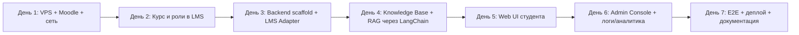

# IMPLEMENTATION_PLAN.md — AI Curator

**Проект:** ai-curator
**Версия:** 2.0
**Дата:** 2026-07-29
**Статус:** Approved
**Срок реализации:** 7 календарных дней

---

## 1. Обзор плана

### 1.1. Source of Truth

| Документ | Назначение |
|----------|------------|
| `AI_CURATOR_SYSTEM_SPECIFICATION.md` | Концепция системы, первичный Source of Truth |
| `docs/PROJECT_STATE.md` | Решения владельца / куратора |
| `docs/SPEC.md` | Продуктовая спецификация |
| `docs/ARCHITECTURE.md` | Архитектурные решения |

### 1.2. Цель семидневного цикла

Получить полностью развёрнутый публичный сервис AI Curator на VPS с HTTPS-эндпоинтами:

- LMS (Moodle) доступна по HTTPS;
- Backend AI Curator работает и интегрирован с LMS API через LMS Adapter;
- Knowledge Base AI Curator управляется через Admin Console;
- RAG-конвейер через LangChain внутри Backend отвечает по учебным материалам;
- Web UI AI Curator — отдельный публичный сервис, позволяет студенту задать вопрос и получить ответ с источниками;
- Admin Console позволяет загружать материалы, управлять метаданными, запускать индексацию, просматривать аналитику и мониторинг;
- Логирование, аналитика и аудит работают;
- Проведено E2E-тестирование ключевых сценариев.

### 1.3. Критерии завершения семидневного цикла

- [x] LMS (Moodle) развёрнута на VPS и доступна по HTTPS.
- [x] В LMS подготовлен курс с модулями, заданиями, дедлайнами и тестовыми ролями.
- [ ] Backend AI Curator работает и подключён к LMS API, Chroma и PostgreSQL.
- [ ] Knowledge Base содержит учебные материалы (лекции, методички, FAQ), загруженные через Admin Console.
- [ ] RAG индексирует материалы Knowledge Base и отвечает по ним.
- [ ] Web UI AI Curator развёрнут как отдельный публичный сервис на VPS и доступен по HTTPS.
- [ ] Admin Console позволяет загружать материалы, управлять версиями и метаданными, запускать индексацию, просматривать аналитику.
- [ ] Логирование, аналитика и аудит работают.
- [ ] Проведено E2E-тестирование ключевых сценариев.
- [ ] Подготовлены DEPLOYMENT_GUIDE.md и материалы для портфолио.

---

## 2. Диаграмма этапов



### 2.1. Критический путь

```
День 1 (VPS + Moodle) → День 2 (Курс + роли) → День 3 (Backend + LMS Adapter)
                                                             ↓
День 4 (Knowledge Base + RAG) → День 5 (Web UI) → День 6 (Admin Console) → День 7 (E2E + деплой)
```

---

## 3. День 1: Инфраструктура VPS, Moodle и сеть

### Цель

Подготовить VPS, настроить Docker-окружение, развернуть Moodle LMS и обеспечить доступ по HTTPS.

### Результат дня

| Артефакт | Признак готовности |
|----------|-------------------|
| VPS подготовлен | SSH-доступ, Docker и Docker Compose установлены |
| Moodle развёрнута | `https://lms.alex-n8n.site` открывается без ошибок |
| HTTPS работает | SSL-сертификат валиден |
| Базовая сеть настроена | Docker-сеть между сервисами работает |
| `.env.example` подготовлен | Плейсхолдеры секретов и доменов |

### Задачи

1. Зарезервировать VPS и домены.
2. Установить Docker, Docker Compose, настроить firewall.
3. Развернуть Moodle через Docker Compose.
4. Настроить Traefik или nginx с Let's Encrypt для HTTPS.
5. Провести первоначальную настройку Moodle.
6. Подготовить `.env.example` для инфраструктуры.

### Критерий завершения

- [x] Moodle доступна по HTTPS.
- [x] Можно войти в Moodle администратором.
- [x] `docker compose ps` показывает healthy-контейнеры.

---

## 4. День 2: Подготовка курса и тестовых ролей в LMS

### Цель

Создать в Moodle учебный курс с модулями, заданиями и дедлайнами; настроить тестовые роли.

### Результат дня

| Артефакт | Признак готовности |
|----------|-------------------|
| Курс создан | В Moodle есть курс «AI Curator Demo Course» |
| Модули добавлены | ≥ 3 модуля с темами |
| Задания с дедлайнами | ≥ 2 задания с указанными дедлайнами |
| Тестовые роли | Студент, преподаватель, администратор Moodle созданы и записаны на курс |
| API-токен read-only | Создан технический пользователь с правами только на чтение |

### Задачи

1. Создать курс и структуру модулей.
2. Создать задания с дедлайнами.
3. Создать пользователей: student@demo, teacher@demo, moodle-admin@demo.
4. Назначить роли на курс.
5. Включить Moodle Web Services, создать роль и токен для read-only API.
6. Зафиксировать примеры данных для E2E-тестирования.

### Критерий завершения

- [x] Студент видит курс, модули, материалы и задания.
- [x] Преподаватель может редактировать курс.
- [x] Дедлайны отображаются корректно.
- [x] API-токен read-only создан и протестирован.

---

## 5. День 3: Backend scaffold и LMS Adapter

### Цель

Подготовить каркас Backend, реализовать LMS Adapter, базовые endpoints и интеграцию с LMS API.

### Результат дня

| Артефакт | Признак готовности |
|----------|-------------------|
| Backend scaffold | FastAPI приложение запускается в Docker |
| PostgreSQL подключена | Миграции применены |
| LMS Adapter | Backend получает курсы, модули, задания, дедлайны, прогресс в канонической модели |
| Health endpoints | `/health`, `/health/lms`, `/health/db` отвечают |
| Базовые API | `GET /api/v1/courses`, `GET /api/v1/courses/{id}/deadlines`, `GET /api/v1/me/progress` |

### Задачи

1. Создать backend на FastAPI: структура, модели, миграции Alembic.
2. Реализовать LMS Adapter внутри Backend: аутентификация, получение курсов, модулей, заданий, материалов, прогресса; преобразование Raw LMS JSON в Canonical Domain Model.
3. Подключить PostgreSQL.
4. Реализовать health endpoints.
5. Реализовать endpoint для получения дедлайнов и прогресса.

### Критерий завершения

- [ ] `GET /health/lms` возвращает статус OK.
- [ ] `GET /api/v1/courses` возвращает список курсов из LMS.
- [ ] `GET /api/v1/courses/{id}/deadlines` возвращает дедлайны.
- [ ] `GET /api/v1/me/progress` возвращает прогресс текущего студента.

---

## 6. День 4: Knowledge Base и RAG через LangChain в Backend

### Цель

Реализовать управление Knowledge Base, загрузку документов, разбиение на фрагменты, embeddings, индексацию в Chroma и retrieval для RAG.

### Результат дня

| Артефакт | Признак готовности |
|----------|-------------------|
| Хранилище документов | Файлы Knowledge Base сохраняются |
| Метаданные KB | Карточки документов с полными метаданными хранятся в PostgreSQL |
| LangChain Document Loader | Markdown / PDF / HTML преобразуются в текст |
| LangChain Chunker | Документы разбиваются на фрагменты с метаданными |
| Chroma интегрирована | Векторы сохраняются и извлекаются |
| RAG endpoint | `POST /api/v1/rag/search` возвращает релевантные фрагменты |
| Processing endpoint | `POST /api/v1/admin/kb/documents/{id}/process` запускает обработку |

### Задачи

1. Развернуть Chroma в Docker.
2. Настроить хранилище документов Knowledge Base.
3. Реализовать модели документов и метаданных в PostgreSQL.
4. Реализовать LangChain Document Loader для Markdown / PDF / HTML.
5. Реализовать LangChain Chunker с сохранением метаданных.
6. Настроить LangChain Embeddings через OpenAI API.
7. Реализовать API загрузки документов и управления метаданными.
8. Реализовать pipeline обработки и индексации.
9. Реализовать RAG search с metadata filters через LangChain Retrieval.
10. Проверить, что поиск находит материалы по теме.

### Критерий завершения

- [ ] Можно загрузить документ в Knowledge Base через API.
- [ ] Метаданные документа сохраняются в PostgreSQL.
- [ ] Обработка создаёт фрагменты и embeddings.
- [ ] Chroma содержит фрагменты с метаданными.
- [ ] RAG search по теме возвращает релевантные результаты.
- [ ] Старая версия документа исключается из активного индекса при публикации новой версии.

---

## 7. День 5: Web UI студента

### Цель

Реализовать отдельный публичный Web UI AI Curator для диалога со студентами.

### Результат дня

| Артефакт | Признак готовности |
|----------|-------------------|
| Web UI собирается | `npm run build` или аналог проходит без ошибок |
| Chat работает | Можно отправить вопрос и получить ответ |
| Источники отображаются | Под ответом есть ссылки на материалы Knowledge Base или задания LMS |
| Переключатель сложности | Есть выбор уровня подготовки |
| HTTPS-доступ | `https://curator.alex-n8n.site` открывается |

### Задачи

1. Реализовать frontend Web UI (React / vanilla — по решению дня 0).
2. Подключить API backend: отправка вопроса, получение ответа, история диалога.
3. Реализовать отображение источников.
4. Реализовать переключатель уровня сложности.
5. Реализовать оценку полезности ответа.
6. Настроить сборку и развёртывание через Docker / nginx.
7. Развернуть Web UI на VPS с HTTPS как отдельный публичный сервис.

### Критерий завершения

- [ ] Студент может задать вопрос и получить ответ.
- [ ] Ответ содержит ссылку на источник.
- [ ] Переключатель сложности влияет на формулировки.
- [ ] Web UI доступен по HTTPS на собственном домене.

---

## 8. День 6: Admin Console, Logging, Analytics и Audit

### Цель

Реализовать Admin Console для управления Knowledge Base, AI-конфигурацией, аналитикой и мониторингом.

### Результат дня

| Артефакт | Признак готовности |
|----------|-------------------|
| Admin Console собирается | Сборка проходит без ошибок |
| Управление KB | Можно загрузить документ, указать метаданные, запустить обработку, опубликовать |
| Версионирование | Можно загрузить новую версию и заменить старую в индексе |
| AI Configuration | Можно изменить системные инструкции, модель, параметры retrieval |
| Аналитика | Доступны частые темы, вопросы без ответа, популярные материалы, оценки, задержки |
| Мониторинг | Отображается состояние Backend, LMS, Knowledge Base, LLM |
| HTTPS-доступ | `https://curator-admin.alex-n8n.site` открывается |

### Задачи

1. Реализовать Admin Console frontend.
2. Реализовать admin endpoints:
   - `/api/v1/admin/kb/documents` — CRUD документов;
   - `/api/v1/admin/kb/documents/{id}/process` — обработка;
   - `/api/v1/admin/kb/documents/{id}/publish` — публикация / снятие;
   - `/api/v1/admin/kb/status` — состояние Knowledge Base;
   - `/api/v1/admin/ai-config` — конфигурация AI;
   - `/api/v1/admin/analytics` — аналитика;
   - `/api/v1/admin/monitoring` — мониторинг;
   - `/api/v1/admin/logs` — логи;
   - `/api/v1/admin/audit` — аудит.
3. Настроить логирование запросов в PostgreSQL.
4. Реализовать агрегацию аналитики по темам, модулям, курсам.
5. Реализовать мониторинг состояния компонентов.
6. Настроить аутентификацию и авторизацию администраторов / методистов.
7. Развернуть Admin Console на VPS с HTTPS.

### Критерий завершения

- [ ] Документ загружается и индексируется из Admin Console.
- [ ] Можно опубликовать / снять с публикации документ.
- [ ] AI-конфигурация версионируется и применяется.
- [ ] Запросы студентов записываются в логи.
- [ ] Аналитика по темам доступна.
- [ ] Мониторинг состояния системы доступен.
- [ ] Admin Console доступен по HTTPS.

---

## 9. День 7: E2E-тестирование, деплой и документация

### Цель

Провести сквозное тестирование, задеплоить все сервисы, подготовить документацию и материалы для портфолио.

### Результат дня

| Артефакт | Признак готовности |
|----------|-------------------|
| E2E-тесты пройдены | Все сценарии из SPEC работают |
| Все сервисы доступны по HTTPS | Web UI, Admin Console, Backend API, Moodle |
| DEPLOYMENT_GUIDE.md | Инструкция по развёртыванию с нуля |
| README актуален | Содержит актуальные домены и инструкции |
| Portfolio presentation | Подготовлено описание кейса для портфолио |

### Задачи

1. Провести E2E-тесты:
   - организационный вопрос о дедлайне;
   - учебный вопрос с ответом из Knowledge Base;
   - смешанный вопрос с персональной рекомендацией;
   - запрос о собственном прогрессе;
   - недостаток данных — честный отказ;
   - загрузка и индексация материала в Knowledge Base;
   - обновление версии документа;
   - снятие материала с публикации;
   - управление AI-конфигурацией;
   - просмотр аналитики и мониторинга.
2. Исправить выявленные дефекты.
3. Подготовить `DEPLOYMENT_GUIDE.md`.
4. Актуализировать README.
5. Подготовить материалы для портфолио.
6. Сделать финальный деплой.

### Критерий завершения

- [ ] Все сценарии SPEC работают в production-like окружении.
- [ ] Все сервисы доступны по HTTPS.
- [ ] DEPLOYMENT_GUIDE.md позволяет понять, как развернуть проект.
- [ ] README отражает актуальное состояние.

---

## 10. Зависимости и критический путь

### 10.1. Внешние зависимости

| Зависимость | Описание | Митигация |
|-------------|----------|-----------|
| VPS и домены | Нужны для публичного деплоя | Зарезервировать заранее |
| Moodle | Source of Truth учебного процесса | Развернуть на том же VPS или отдельном контейнере |
| LLM API | Необходим для генерации ответов | Иметь запасной ключ / fallback |
| OpenAI API | Эмбеддинги и LLM | Мониторить лимиты и стоимость |
| Knowledge Base content | Необходимы учебные материалы для RAG | Подготовить методистский контент заранее |

### 10.2. Внутренние зависимости

| Этап | Зависит от | Почему |
|------|------------|--------|
| День 2 | День 1 | Нужен развёрнутый Moodle |
| День 3 | День 2 | Нужен курс и API-токен |
| День 4 | День 3 | Нужен backend и LMS Adapter |
| День 5 | День 4 | Нужен работающий RAG |
| День 6 | День 5 | Нужен Web UI для получения логов |
| День 7 | День 6 | Нужен полный контур для E2E |

### 10.3. Критический путь

```
День 1 → День 2 → День 3 → День 4 → День 5 → День 6 → День 7
```

Задержка на любом из дней сдвигает финальный деплой.

---

## 11. Риски и митигация

| Риск | Вероятность | Влияние | Митигация |
|------|-------------|--------|-----------|
| Проблемы с Moodle API | Средняя | Высокое | Подготовить read-only роль, проверять права |
| Высокая стоимость LLM | Средняя | Среднее | Ограничить max_tokens, кэшировать частые запросы |
| Некорректные ответы AI | Средняя | Высокое | RAG + источники + few-shot + answer validation + логирование |
| Сложности с HTTPS/доменами | Низкая | Среднее | Использовать проверенную схему Traefik + Let's Encrypt |
| Перегрузка VPS | Средняя | Среднее | Минимизировать контейнеры, мониторить ресурсы |
| Наполнение Knowledge Base | Средняя | Высокое | Подготовить методистский процесс и контент заранее |

---

## 12. Документация, создаваемая в ходе реализации

| Документ | День | Назначение |
|----------|------|------------|
| `DEPLOYMENT_GUIDE.md` | День 7 | Source of Truth развёртывания |
| `docs/API_CONTRACT.md` | День 3–4 | Контракты API |
| `docs/PROMPT_ARCHITECTURE.md` | День 4–5 | Структура промптов и few-shot примеры |
| `docs/OPERATIONS.md` | День 6–7 | Эксплуатация, обновление Knowledge Base |
| `README.md` | День 7 | Актуализация публичного описания |

---

## 13. История изменений

| Дата | Версия | Изменения |
|------|--------|-----------|
| 2026-07-29 | 2.0 | Пересоздан IMPLEMENTATION_PLAN.md на основе AI_CURATOR_SYSTEM_SPECIFICATION.md: Knowledge Base загружается через Admin Console, Web UI — отдельный публичный сервис на VPS, Backend как единый оркестратор |
| 2026-07-29 | 2.0 (Approved) | Документ согласован куратором. Статус изменён на Approved. |
| 2026-07-29 | 1.0 | Первая версия IMPLEMENTATION_PLAN на 7 дней |
