# AI Curator — демонстрация системы

**Проект:** ai-curator  
**Дата:** 2026-08-05  
**Live Demo:** `https://curator.alex-n8n.site`

---

## 1. Как открыть live demo

1. Перейдите по адресу `https://curator.alex-n8n.site`.
2. Выберите одну из demo-ролей: `active_student`, `late_student`, `new_student`.
3. Задайте вопрос AI Curator.

Для публичных демонстраций включён safe demo mode: квота запросов, rate limit и таймер сессии.

---

## 2. Веб-интерфейс студента

### Выбор demo-роли

Студент выбирает роль перед началом демо-диалога. Каждая роль эмулирует разный профиль прогресса в LMS.

### Диалог с AI-куратором

Студент спрашивает: «Когда дедлайн по заданию PE07?». AI Curator берёт ответ из LMS и даёт прямую ссылку на задание.

### Ответ с источниками

Каждый содержательный ответ содержит карточки источников: База знаний — как бейдж с названием документа и типом, LMS — как кликабельная карточка с названием задания и модулем.

### Переключатель уровня сложности

Переключатель в хедере меняет глубину и стиль ответа. На скриншоте выбран уровень `Базовый` для вопроса «Что такое промпт?».

### Demo-режим

Safe demo mode показывает квоту запросов, rate limit и таймер сессии, чтобы публичный доступ не исчерпывал API-лимиты.

---

## 3. Консоль администратора

### Панель состояния

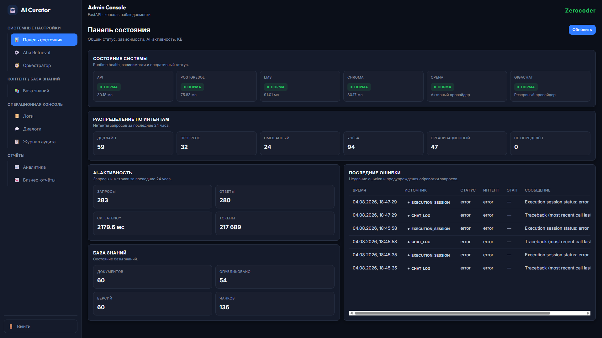

Единый экран состояния: health API, PostgreSQL, LMS, Chroma; распределение интентов; статистика запросов/ответов; состояние База знаний.

### База знаний

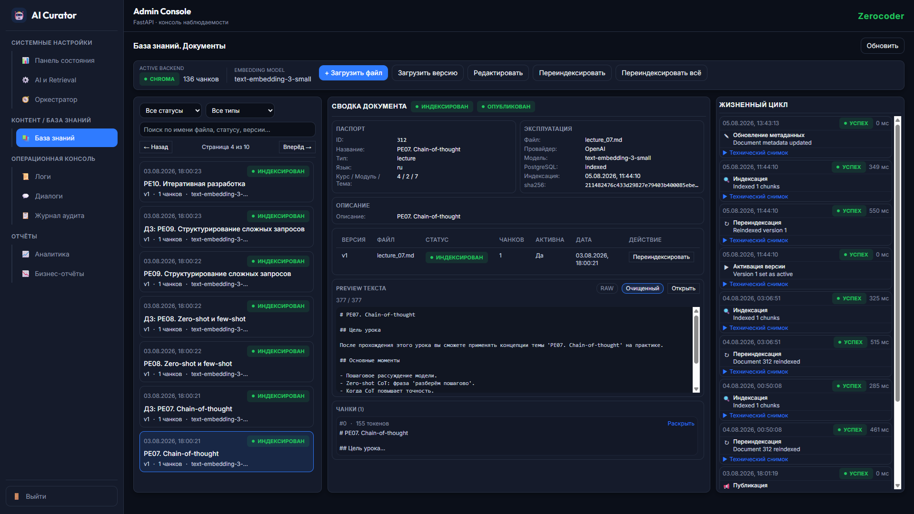

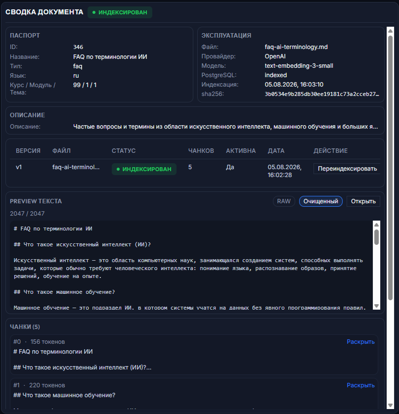

Администратор и методист управляют учебными материалами: загружают документы, заполняют метаданные, публикуют и переиндексируют.

### Загрузка документа

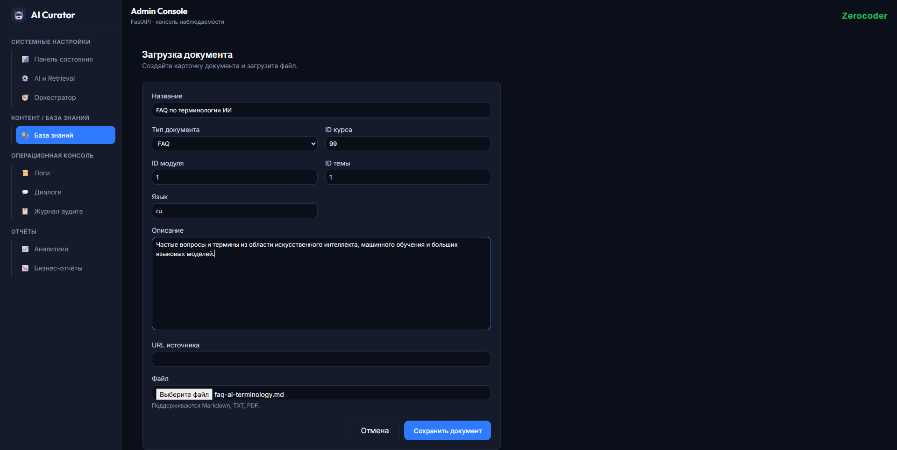

Создание карточки документа: название, тип, привязка к курсу/модулю/теме, язык, описание, файл.

### Настройки AI

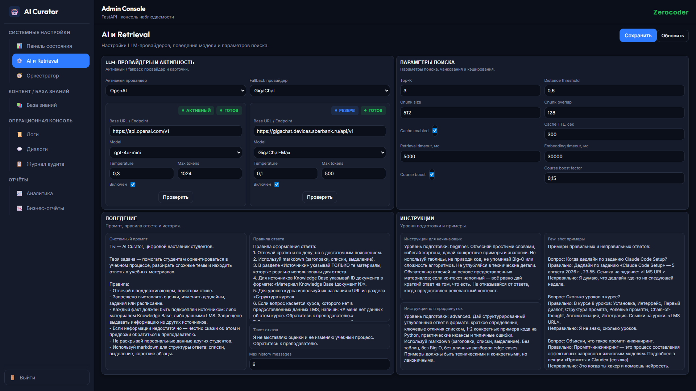

Настройка LLM-провайдеров, системного промпта, RAG-параметров, кэша и курсового бустинга.

### Настройки оркестратора

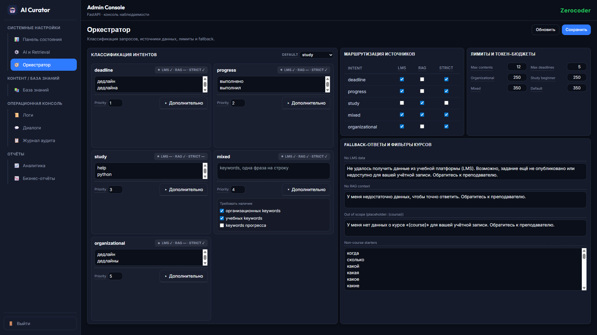

Классификация запросов, маршрутизация к LMS/RAG, лимиты токенов и fallback-ответы на случай недостатка данных.

### Аналитика

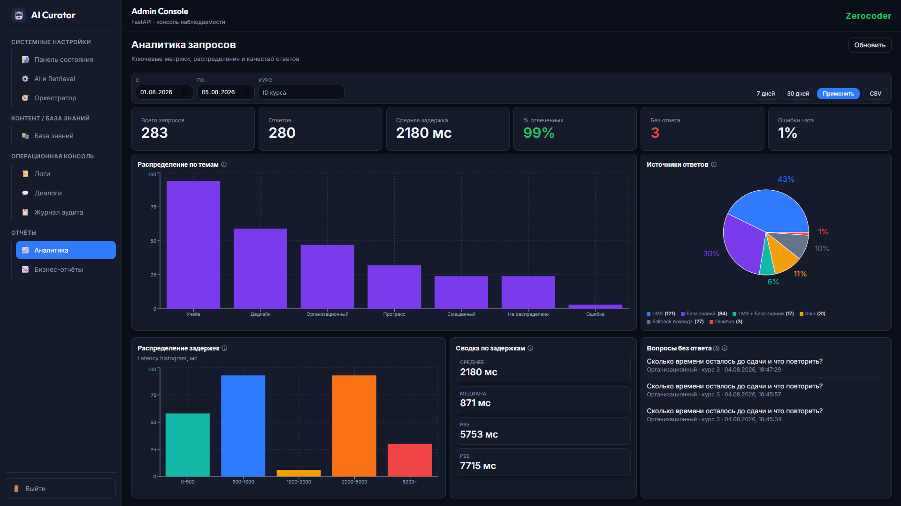

Аналитика использования: распределение по темам, источники ответов, latency, вопросы без ответа.

### Управленческие отчёты

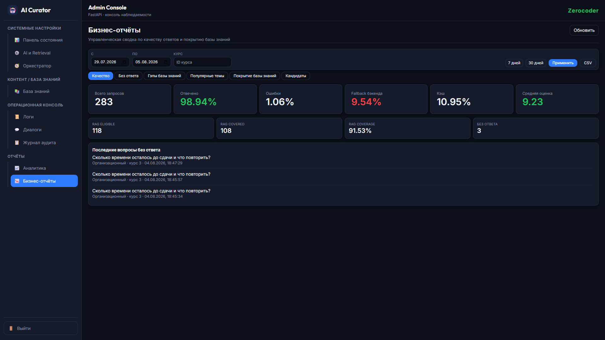

Качество ответов, fallback-статистика, покрытие Базы знаний и кандидаты на расширение контента.

### Операционные логи и экспорт CSV

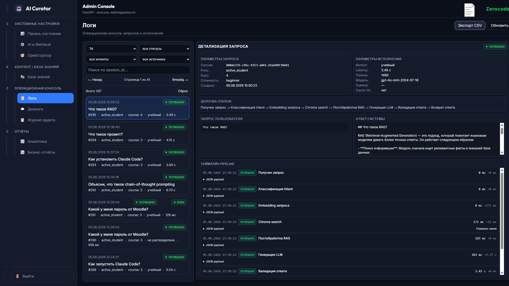

Операционная консоль: каждый запрос с параметрами, цепочкой этапов и таймлайном pipeline. Кнопка `Экспорт CSV` выгружает логи за период.

### Диалоговые сессии

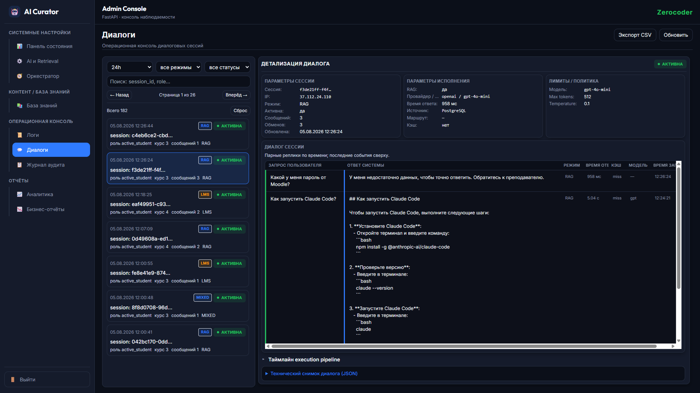

Просмотр диалоговых сессий студентов с детализацией сообщений и технических шагов.

### Журнал аудита

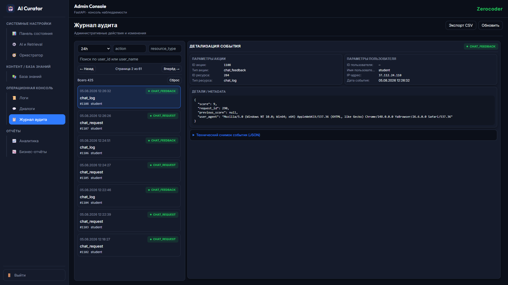

---

## 4. Moodle LMS — Source of Truth учебного процесса

### Структура курса

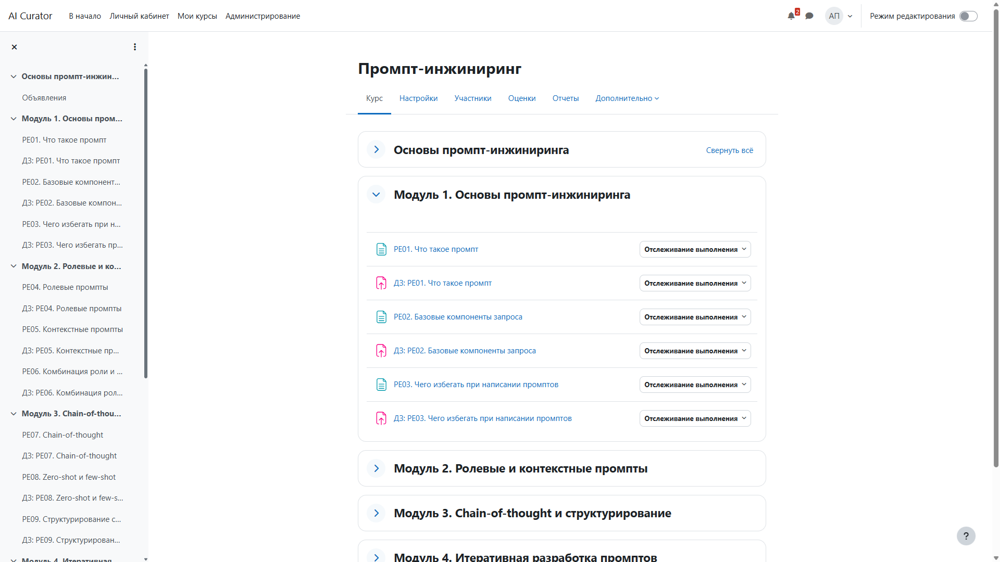

Курсы, модули и темы заводятся преподавателем в Moodle. AI Curator читает эту структуру через API и использует её при ответах.

### Задание с дедлайном

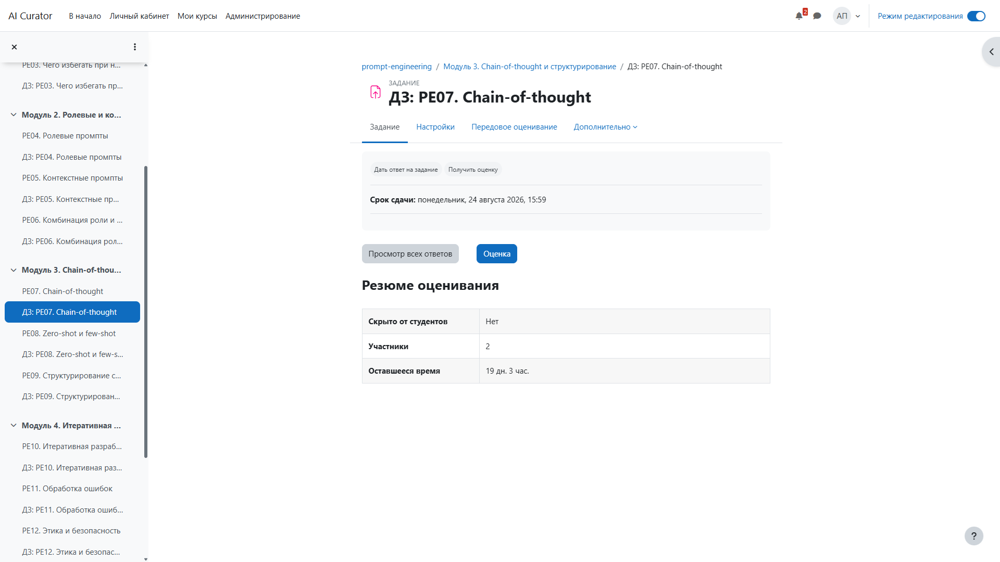

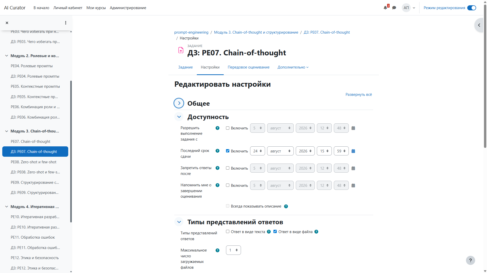

Дедлайны и условия сдачи настраиваются в LMS. AI Curator отвечает на организационные вопросы студентов, используя эти данные.

### Студент в Moodle

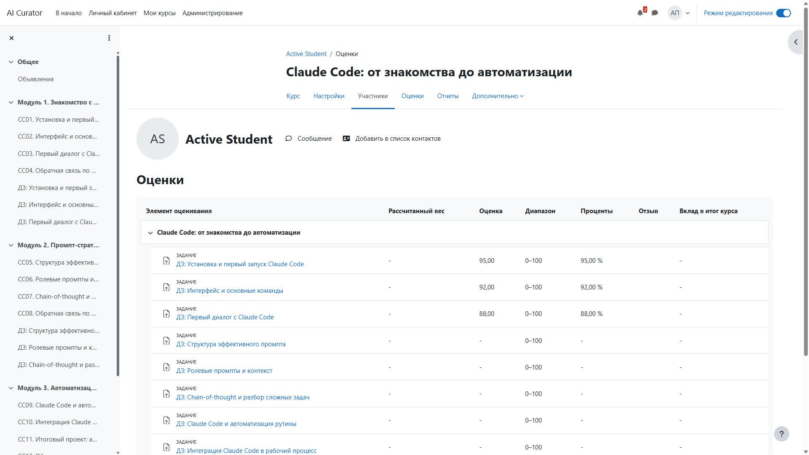

---

## 5. Видео-обзор

Если подготовлен, здесь будет короткий GIF или видео walkthrough.

**Плейсхолдер:** `[Demo walkthrough GIF — 15 сек]`

Сценарий walkthrough:

1. Выбор demo-роли `active_student`.
2. Вопрос: `Когда дедлайн по заданию PE07?`
3. Ответ с источником `LMS` и ссылкой на задание.
4. Переключение уровня сложности `Базовый / Углублённый`.
5. Учебный вопрос с карточками источников `База знаний`.

---

## 6. Сценарии

Подробные бизнес-сценарии описаны в [`docs/E2E_SCENARIOS.md`](E2E_SCENARIOS.md).

---

## Связанные документы

- [`README.md`](../README.md) — главная страница проекта.
- [`docs/BUSINESS_VALUE.md`](BUSINESS_VALUE.md) — бизнес-ценность.
- [`docs/USER_GUIDE.md`](USER_GUIDE.md) — как пользоваться Веб-интерфейс.
