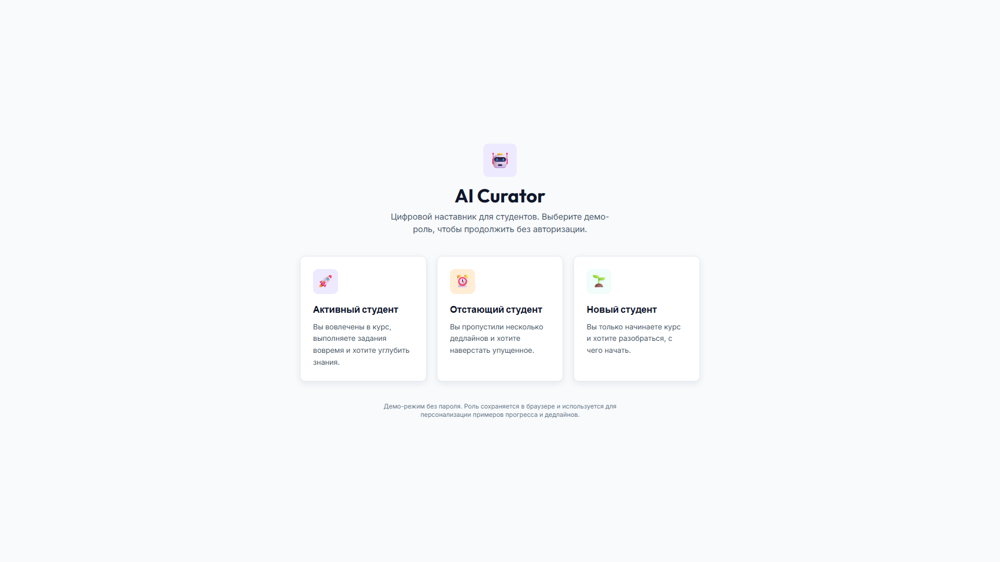
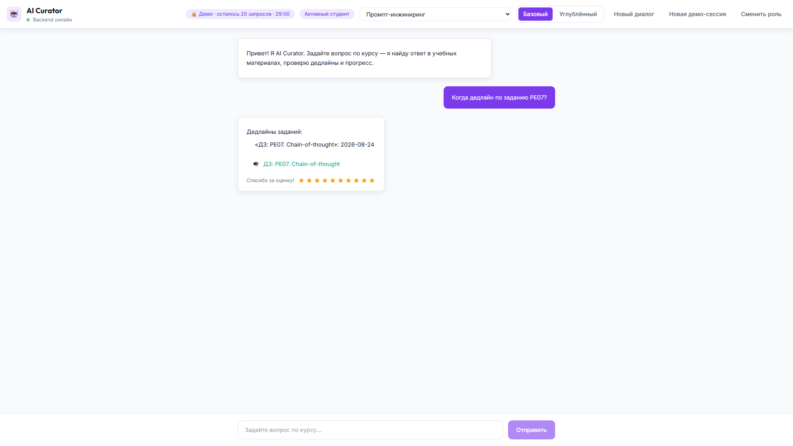
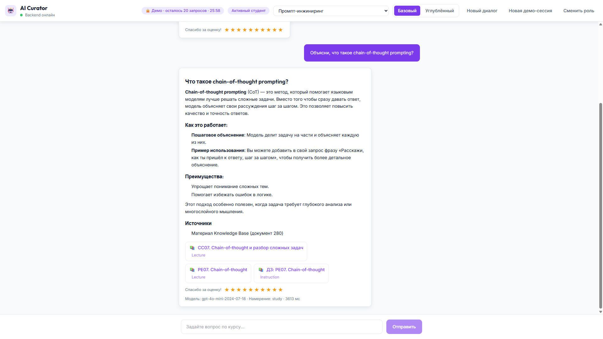
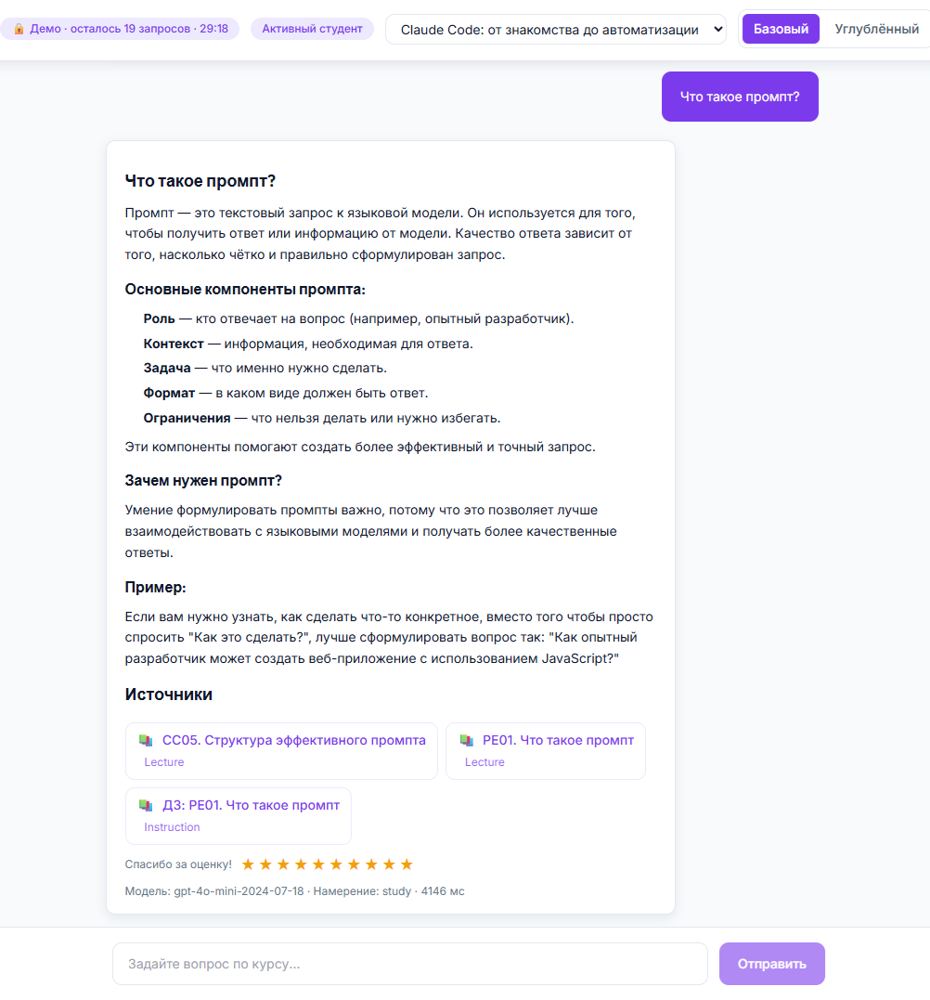
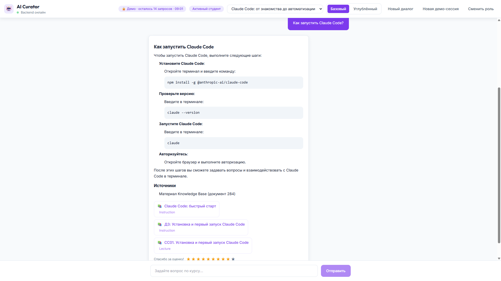
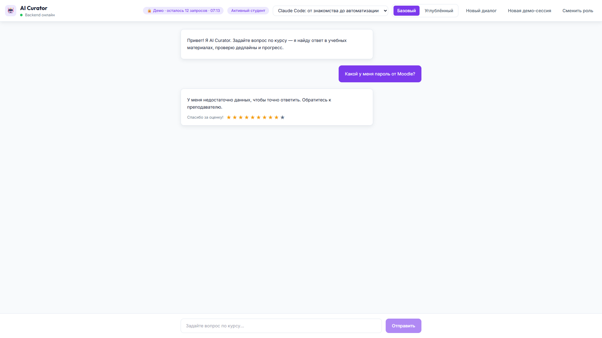

# 📖 AI Curator — руководство студента

**Проект:** ai-curator  
**Дата:** 2026-08-05

🌐 **Live Demo:** [▶️ Открыть веб-интерфейс студента](https://curator.alex-n8n.site)

---

## 🎓 1. Что такое AI Curator

AI Curator — это AI-ассистент для студентов. Он помогает:

- узнать дедлайны и статус заданий;
- получить объяснение учебной темы;
- найти нужную лекцию или методичку;
- получить персональную рекомендацию по обучению.

AI Curator не заменяет преподавателя, не выставляет оценки и не изменяет учебный процесс.

---

## 🚀 2. Как открыть

1. Откройте [▶️ веб-интерфейс студента](https://curator.alex-n8n.site).
2. Выберите demo-роль или войдите, если у вас есть учётная запись.
3. Начните диалог.

---

## 🎭 3. Demo-роли

Если включён safe demo mode, Веб-интерфейс предлагает выбрать одну из ролей:

| Роль | Описание |
|------|----------|
| `active_student` | Студент, который вовлечён в курс |
| `late_student` | Студент с пропущенными дедлайнами |
| `new_student` | Студент, только начавший курс |

Каждая роль имеет собственный контекст курса и прогресса.

---

## 💬 4. Как задать вопрос

1. Введите вопрос в поле ввода.
2. Нажмите Enter или кнопку отправки.
3. Подождите ответ.

Примеры вопросов:

- `Когда дедлайн по заданию PE07?`
- `Что такое промпт?`
- `Объясни, что такое chain-of-thought prompting.`
- `Что мне повторить перед заданием в пятницу?`
- `Где найти лекцию по few-shot prompting?`

---

## 🔗 5. Источники ответа

Каждый содержательный ответ сопровождается карточками источников:

| Тип источника | Что показывается | Пример |
|---|---|---|
| **LMS** | Название задания или модуля, прямая ссылка, модуль/тема | `ДЗ: PE07. Chain-of-thought` |
| **База знаний** | Название документа и его тип (`lecture`, `methodical`, `faq`...) | `PE07. Chain-of-thought · lecture` |

Если источник не найден, AI Curator явно сообщит об этом и предложит обратиться к преподавателю.

---

## 🎚️ 6. Уровень сложности

Переключатель `Базовый / Углублённый` в верхней панели меняет стиль ответа:

- **Базовый** — простыми словами, с пошаговыми объяснениями и примерами.
- **Углублённый** — углублённо, с техническими деталями.

---

## ⭐ 7. Оценка полезности ответа

После каждого ответа вы можете поставить оценку полезности от 1 до 10 звёздочками ⭐. Это помогает администратору улучшать качество AI Curator.

---

## 🔒 8. Demo-режим

Если вы используете публичный demo-доступ, в интерфейсе отображается:

- бейдж `🔒 Demo`;
- количество оставшихся запросов;
- таймер до истечения сессии.

---

## ⚠️ 9. Ограничения

AI Curator не умеет и не будет:

- выставлять оценки;
- переносить дедлайны;
- изменять расписание;
- принимать решения вместо преподавателя;
- работать с личными учётными данными (пароли, email).

---

## ❓ 10. Что делать, если ответ не подошёл

1. Уточните вопрос.
2. Попробуйте изменить уровень сложности.
3. Проверьте, что вопрос относится к курсу.
4. Если ответ всё ещё не найден — обратитесь к преподавателю.

---

## 📚 Связанные документы

- [🏠 `README.md`](../README.md) — главная страница проекта.
- [🎬 `docs/SYSTEM_DEMO.md`](SYSTEM_DEMO.md) — скриншоты и live demo.
- [🎬 `docs/E2E_SCENARIOS.md`](E2E_SCENARIOS.md) — бизнес-сценарии.
- [❓ `docs/FAQ.md`](FAQ.md) — ответы на частые вопросы студента.
- [🌐 `docs/WEB_UI.md`](WEB_UI.md) — component reference Web UI.
